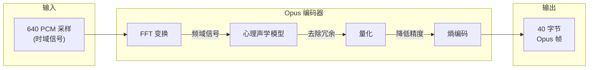
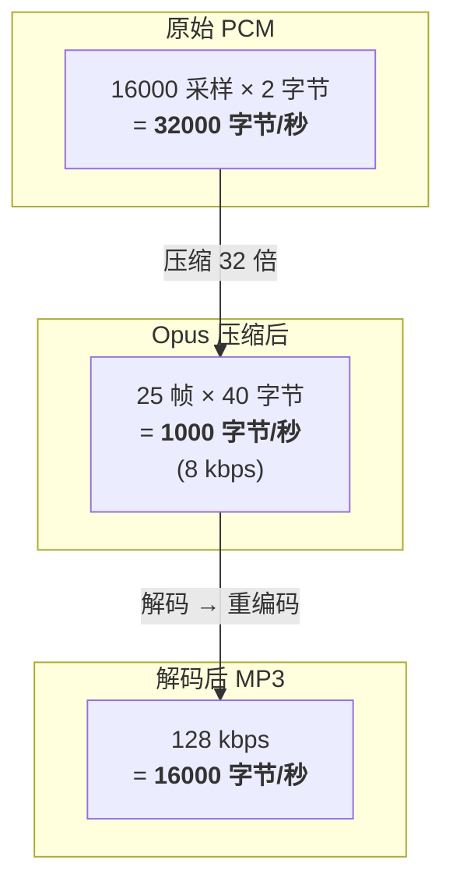

# 音频编解码核心概念

> **文档类型**: 技术原理说明
> **目标读者**: 需要理解音频编解码原理的开发者

---

## 目录

- [核心概念：PCM 采样 vs Opus 帧](#核心概念pcm-采样-vs-opus-帧)
- [Opus 编码原理](#opus-编码原理)
- [Opus 帧时长选择](#opus-帧时长选择)
- [数据流与压缩比](#数据流与压缩比)
- [术语对照表](#术语对照表)
- [计算公式速查](#计算公式速查)

---

## 核心概念：PCM 采样 vs Opus 帧

### 常见误区

> 16kHz 采样率 = 每秒 16000 次采样，但这**不意味着** 1 个 Opus 帧 = 1 次采样。

```
PCM 采样 (Sample)     ≠     Opus 帧 (Frame)
       ↓                          ↓
   单个采样点               一组采样的压缩包
```

### PCM 原始音频

PCM (Pulse Code Modulation) 是未压缩的原始音频格式：

- **采样率 16kHz** = 每秒采集 16000 个音频样本
- **每个样本** = 1 个 Int16 值（16-bit，2 字节）
- **1 秒原始数据** = 16000 × 2 = 32000 字节

```
PCM 时间轴 (1秒)：
├─1─┼─2─┼─3─┼─4─┼─5─┼─...─┼─16000─┤
     每个点 = 1次采样 = 1个Int16值
```

### Opus 帧

Opus 帧是**一组 PCM 采样经过压缩后的结果**，不是单个采样。

Note 设备配置：
- **1 个 Opus 帧** = 640 个 PCM 采样压缩后的结果
- **Opus 帧大小** = 40 字节

---

## Opus 编码原理

### 为什么不能逐采样压缩？

| 压缩方式 | 效率 | 原因 |
|----------|------|------|
| 逐采样压缩 | ❌ 极低 | 单个数值无规律可循，无法有效压缩 |
| 批量压缩 | ✅ 高效 | 可分析频率特征、利用人耳听觉盲区去除冗余 |

### 批量压缩流程

```
┌─────────────────────────────────────────────────────┐
│  输入：640 个 PCM 采样（40ms 音频）                 │
│        = 640 × 2 字节 = 1280 字节                   │
└─────────────────────────────────────────────────────┘
                         │
                         ▼
                ┌───────────────┐
                │  Opus 编码器  │
                │               │
                │  1. FFT 变换  │  ← 时域 → 频域
                │  2. 心理声学  │  ← 去除人耳听不到的频率
                │  3. 量化      │  ← 降低精度
                │  4. 熵编码    │  ← 无损压缩
                └───────────────┘
                         │
                         ▼
┌─────────────────────────────────────────────────────┐
│  输出：1 个 Opus 帧 = 40 字节                       │
│        压缩比 = 1280 / 40 = 32 倍                   │
└─────────────────────────────────────────────────────┘
```

### 编码器内部处理



---

## Opus 帧时长选择

### Opus 标准帧时长

Opus 规范支持 6 种帧时长：

| 帧时长 | 16kHz 单声道采样数 | 适用场景 | 延迟 | 压缩效率 |
|--------|-------------------|----------|------|----------|
| 2.5ms | 40 | 超低延迟通信 | 极低 | 较低 |
| 5ms | 80 | 实时游戏语音 | 很低 | 较低 |
| 10ms | 160 | 实时流式传输 | 低 | 中等 |
| 20ms | 320 | VoIP 通话 | 中等 | 较高 |
| **40ms** | **640** | **录音存储** | 较高 | **高** |
| 60ms | 960 | 音乐存储 | 高 | 最高 |

### 设备选择对比

| 设备 | 帧时长 | 采样数 | 用途 | 选择原因 |
|------|--------|--------|------|----------|
| Omi | 10ms | 160 | 实时流式传输 | 需要低延迟 |
| Note | 40ms | 640 | 本地录音存储 | 不需要低延迟，追求高压缩 |

### 帧时长与比特率的关系

Note 设备配置：
- 帧时长：40ms
- Opus 帧大小：40 字节 = 320 bits
- 比特率：320 bits / 0.04s = **8 kbps**

```
比特率 = (帧大小 × 8) / 帧时长

8000 bps = (40 bytes × 8 bits) / 0.04 seconds
```

---

## 数据流与压缩比

### 1 秒音频的数据量对比



### 详细数据流

```
原始录音 (16kHz 单声道 16-bit)
│
│  每秒产生：16000 采样 × 2 字节 = 32000 字节
│
▼
┌────────────────────────────────────────┐
│  Opus 编码 (Note 设备固件)              │
│  - 每 40ms (640采样) 编码为 1 帧        │
│  - 每帧 40 字节                         │
│  - 每秒 25 帧 = 1000 字节 (8 kbps)      │
└────────────────────────────────────────┘
│
│  压缩比：32000 / 1000 = 32 倍
│
▼
┌────────────────────────────────────────┐
│  .opus 文件存储                         │
│  27 分钟录音 ≈ 1.6 MB                   │
└────────────────────────────────────────┘
│
│  BLE 下载到手机
│
▼
┌────────────────────────────────────────┐
│  Opus 解码 (APP - libopus FFI)         │
│  - 每 40 字节 Opus 帧                   │
│  - 解码为 640 个 Int16 采样             │
│  - 输出 1280 字节 PCM                   │
└────────────────────────────────────────┘
│
│  恢复为原始 PCM
│
▼
┌────────────────────────────────────────┐
│  MP3 编码 (APP - LAME)                 │
│  - 输入：PCM16 数据                     │
│  - 输出：128 kbps MP3                  │
└────────────────────────────────────────┘
│
▼
┌────────────────────────────────────────┐
│  .mp3 文件                              │
│  27 分钟 ≈ 26 MB (比 Opus 大很多)       │
└────────────────────────────────────────┘
```

### 文件大小对比

以 27 分钟录音为例：

| 格式 | 比特率 | 文件大小 | 说明 |
|------|--------|----------|------|
| PCM (原始) | 256 kbps | ~52 MB | 未压缩 |
| **Opus** | **8 kbps** | **~1.6 MB** | Note 设备存储 |
| MP3 | 128 kbps | ~26 MB | 便于分享播放 |

---

## 术语对照表

| 中文 | 英文 | 含义 | Note 设备值 |
|------|------|------|-------------|
| 采样 | Sample | 单个音频测量点，1 个数值 | 1 个 Int16 |
| 采样率 | Sample Rate | 每秒采样次数 | 16000 Hz |
| 位深度 | Bit Depth | 每个采样的精度 | 16-bit |
| 声道 | Channel | 音频通道数 | 1 (单声道) |
| PCM 帧 | PCM Frame | 一组 PCM 采样 | 640 采样 |
| Opus 帧 | Opus Frame | 一组采样压缩后的数据包 | 40 字节 |
| 帧时长 | Frame Duration | 每帧对应的时间长度 | 40 ms |
| 比特率 | Bitrate | 每秒数据量 | 8 kbps |

---

## 计算公式速查

### 基础公式

```
采样数 = 采样率 × 帧时长
  640  = 16000  × 0.04

原始字节数 = 采样数 × 字节/采样 × 声道数
  1280     =  640   ×    2      ×   1

压缩比 = 原始字节数 / Opus帧字节数
  32   =   1280    /    40

比特率 = (Opus帧字节数 × 8) / 帧时长
 8000  = (    40      × 8) /  0.04
```

### 文件大小估算

```
Opus 文件大小 = 时长(秒) × 比特率(bps) / 8
             = 1620    ×   8000     / 8
             = 1,620,000 字节 ≈ 1.6 MB  (27分钟)

MP3 文件大小 = 时长(秒) × 比特率(bps) / 8
            = 1620    ×  128000    / 8
            = 25,920,000 字节 ≈ 26 MB  (27分钟)
```

### 每秒帧数

```
每秒帧数 = 1000ms / 帧时长(ms)
   25   = 1000   /    40
```

---

## 参考资料

- [Opus Codec 官方文档](https://opus-codec.org/)
- [RFC 6716 - Opus Audio Codec](https://tools.ietf.org/html/rfc6716)
- [Note 设备快速指南](./note-device-quick-guide.md)

---

**文档版本**: v1.0
**创建日期**: 2025-01-13
**维护者**: Omi Team
