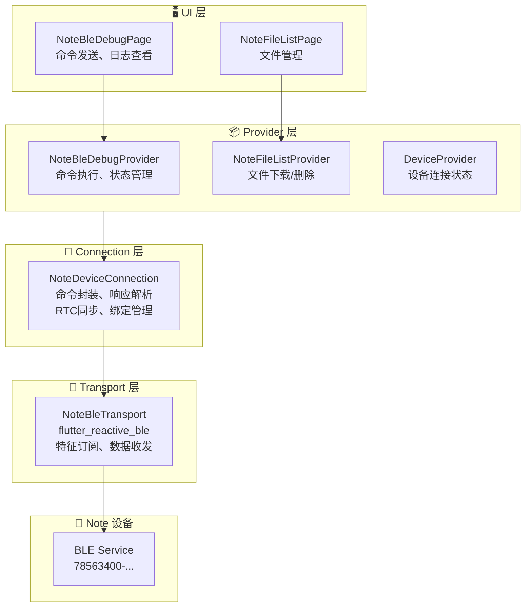
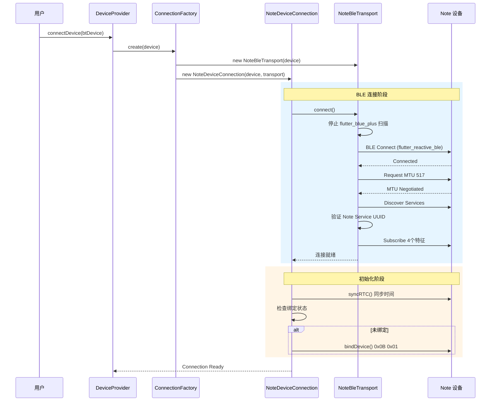
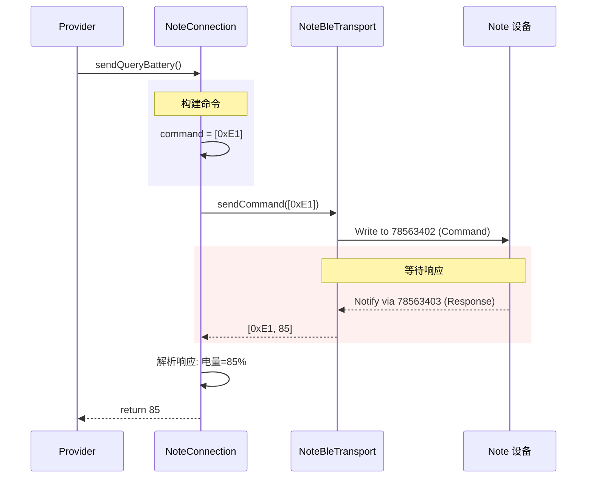
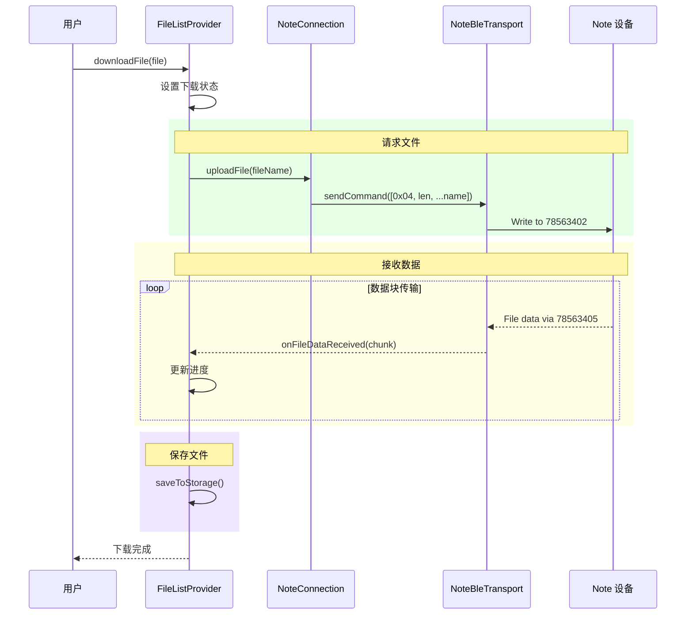

# BLE 功能 API 文档 (Note 设备)

> **文档类型**: API 参考文档
> **目标读者**: 需要集成、维护或扩展 Note 设备 BLE 功能的开发者
> **相关文档**: [Note 设备快速指南](./note-device-quick-guide.md)

---

## 目录

- [概述](#概述)
- [整体架构](#整体架构)
- [Note 设备通信流程](#note-设备通信流程)
- [Note 设备 API 参考](#note-设备-api-参考)
- [Debug 页面功能](#debug-页面功能)
- [BLE 特征 UUID 参考](#ble-特征-uuid-参考)
- [命令协议速查](#命令协议速查)
- [关键代码速查](#关键代码速查)

---

## 概述

本文档提供 Note 设备 BLE 通信功能的 API 参考。Note 设备使用 `flutter_reactive_ble` 库实现 BLE 通信，与其他设备（使用 `flutter_blue_plus`）的实现有所不同。

### 技术栈

| 组件 | 技术 | 说明 |
|------|------|------|
| BLE 通信 | `flutter_reactive_ble ^5.4.0` | Note 设备专用 |
| 状态管理 | Provider | NoteBleDebugProvider |
| 架构模式 | 四层架构 | UI → Provider → Connection → Transport |
| 音频编解码 | Opus | 16kHz 单声道 |

---

## 整体架构

### 架构分层图



### 文件结构

```
lib/
├── pages/note_debug/
│   ├── note_ble_debug_page.dart       # BLE 调试页面
│   ├── note_file_list_page.dart       # 文件列表页面
│   ├── models/
│   │   └── ble_log_entry.dart         # 日志模型
│   └── widgets/
│       ├── command_button.dart        # 命令按钮
│       ├── command_category_section.dart
│       ├── ble_log_drawer.dart        # 日志抽屉
│       └── file_list_item.dart        # 文件项
│
├── providers/
│   ├── note_ble_debug_provider.dart   # Debug 状态管理
│   ├── note_file_list_provider.dart   # 文件列表状态
│   └── note_device_provider.dart      # 设备状态
│
├── services/devices/
│   ├── note_connection.dart           # Note 设备连接
│   ├── note_commands.dart             # 命令/UUID 定义
│   ├── note_ota_service.dart          # OTA 服务
│   ├── note_storage_manager.dart      # 绑定信息存储
│   └── transports/
│       └── note_ble_transport.dart    # BLE 传输层
│
└── backend/schema/bt_device/
    └── note_device.dart               # 数据模型
```

---

## Note 设备通信流程

### 1. 设备连接流程



### 2. 命令发送流程



### 3. 文件下载流程



---

## Note 设备 API 参考

### NoteDeviceConnection

**文件**: `lib/services/devices/note_connection.dart`

#### 设备信息查询

| 方法 | 返回值 | 说明 |
|------|--------|------|
| `performRetrieveBatteryLevel()` | `Future<int>` | 查询电量 (0-100) |
| `queryFirmwareVersion()` | `Future<String>` | 查询固件版本 (vX.Y.Z) |
| `queryStorage()` | `Future<NoteStorageInfo>` | 查询存储空间 |

#### 录音控制

| 方法 | 返回值 | 说明 |
|------|--------|------|
| `startRecording()` | `Future<bool>` | 开始录音 |
| `stopRecording()` | `Future<Map>` | 停止录音，返回文件信息 |
| `setRecordingMode(mode)` | `Future<void>` | 设置录音模式 |

#### 文件管理

| 方法 | 返回值 | 说明 |
|------|--------|------|
| `getFileList()` | `Future<List<NoteFileInfo>>` | 获取文件列表 |
| `uploadFile(fileName)` | `Future<void>` | 请求上传文件 |
| `deleteFile(fileName)` | `Future<void>` | 删除文件 |

#### 设备管理

| 方法 | 返回值 | 说明 |
|------|--------|------|
| `syncRTC()` | `Future<void>` | 同步 RTC 时间 |
| `bindDevice()` | `Future<void>` | 绑定设备 |
| `unbindDevice()` | `Future<void>` | 解绑设备 |
| `setUsbMode(enabled)` | `Future<void>` | 开关 U盘模式 |
| `reboot()` | `Future<void>` | 设备重启 |
| `factoryReset(keepRecordings)` | `Future<bool>` | 恢复出厂设置 |

#### 使用示例

```dart
// 获取 Note 设备连接
final connection = await ServiceManager.instance()
    .device.ensureConnection(deviceId);

if (connection is NoteDeviceConnection) {
  // 查询电量
  final battery = await connection.performRetrieveBatteryLevel();
  print('Battery: $battery%');

  // 查询版本
  final version = await connection.queryFirmwareVersion();
  print('Version: $version');

  // 开始录音
  final success = await connection.startRecording();

  // 获取文件列表
  final files = await connection.getFileList();
  for (final file in files) {
    print('${file.name} - ${file.durationSeconds}s');
  }
}
```

### NoteBleTransport

**文件**: `lib/services/devices/transports/note_ble_transport.dart`

#### 数据流

| 属性 | 类型 | 说明 |
|------|------|------|
| `audioStream` | `Stream<List<int>>` | 音频数据流 (78563401) |
| `responseStream` | `Stream<List<int>>` | 响应数据流 (78563403) |
| `fileStream` | `Stream<List<int>>` | 文件数据流 (78563405) |
| `logStream` | `Stream<List<int>>` | 日志数据流 (78563406) |
| `negotiatedMtu` | `int` | 协商的 MTU 值 |

#### 方法

| 方法 | 说明 |
|------|------|
| `connect()` | 连接设备 (MTU协商 + 服务发现 + 特征订阅) |
| `disconnect()` | 断开连接 (清理 GATT 缓存) |
| `sendCommand(command)` | 发送命令 (无响应写入) |
| `sendOtaData(data)` | 发送 OTA 数据 (有响应写入) |

---

## Debug 页面功能

### 功能概览

Debug 页面 (`NoteBleDebugPage`) 提供以下功能模块：

| 模块 | 功能 | 实现方式 |
|------|------|----------|
| **Recording** | 录音控制 | `startRecording()` / `stopRecording()` |
| **Device Info** | 设备信息查询 | `queryBattery()` / `queryVersion()` / `queryStorage()` |
| **File Management** | 文件管理 | 跳转到 `NoteFileListPage` |
| **Device Control** | 设备控制 | 绑定/解绑/U盘模式/重启/恢复出厂 |
| **OTA** | 固件升级 | 进入 OTA 模式 |
| **Custom Command** | 自定义命令 | 发送任意 HEX 命令 |

### 功能详细列表

#### Recording (录音控制)

| 按钮 | 命令 | Provider 方法 | 说明 |
|------|------|---------------|------|
| Start Recording | `0x01` | `sendStartRecording()` | 开始录音 |
| Stop Recording | `0x02` | `sendStopRecording()` | 停止录音 |
| Set Recording Mode | `0x0D + mode` | `sendSetRecordingMode(mode)` | 设置模式: 仅录音(0x01) / 边录边传(0x10) |

#### Device Info (设备信息)

| 按钮 | 命令 | Provider 方法 | 响应解析 |
|------|------|---------------|----------|
| Query Battery | `0xE1` | `sendQueryBattery()` | 返回电量百分比 |
| Query Version | `0xE3` | `sendQueryVersion()` | 返回 9 字节版本号 |
| Query Storage | `0xE8` | `sendQueryStorage()` | 返回 已用KB/总KB |

#### Device Control (设备控制)

| 按钮 | 命令 | Provider 方法 | 说明 |
|------|------|---------------|------|
| Sync RTC | `0xE5 + 4字节时间戳` | `sendSyncRTC()` | 同步系统时间 |
| Bind Device | `0x0B 0x01` | `sendBindDevice()` | 绑定设备 |
| Unbind Device | `0x0B 0x00` | `sendUnbindDevice()` | 解绑设备 |
| USB Mode ON | `0xE4 0x01` | `sendSetUsbMode(true)` | 开启 U盘模式 |
| USB Mode OFF | `0xE4 0x00` | `sendSetUsbMode(false)` | 关闭 U盘模式 |
| Reboot | `0x09` | `sendReboot()` | 设备重启 |
| Factory Reset (Keep) | `0xE9 0x00` | `sendFactoryReset(true)` | 恢复出厂 (保留文件) |
| Factory Reset (Delete) | `0xE9 0xFF` | `sendFactoryReset(false)` | 恢复出厂 (删除文件) |

#### OTA (固件升级)

| 按钮 | 命令 | Provider 方法 | 说明 |
|------|------|---------------|------|
| Enter OTA (8711) | `0xE6 0x04` | `sendOtaEnter(module8711)` | 进入主控模块 OTA |
| Enter OTA (3085) | `0xE6 0x01` | `sendOtaEnter(module3085)` | 进入 WiFi/蓝牙模块 OTA |

#### Custom Command (自定义命令)

```dart
// 支持格式:
// "E1"
// "0xE1"
// "E1 00"
// "0xE1 0x00"

provider.sendCustomCommand("E1 00");
```

### Debug 页面 UI 布局

```
┌─────────────────────────────────────┐
│  BLE Debug                    📋 ⟨  │  ← 日志按钮带数量徽章
├─────────────────────────────────────┤
│  ● Connected                        │  ← 连接状态
├─────────────────────────────────────┤
│  ▼ Recording                        │
│  ┌─────────────────────────────────┐│
│  │ Status: Idle / Recording       ││  ← 录音状态指示
│  │ Start Recording         0x01   ││
│  │ Stop Recording          0x02   ││
│  │ Set Mode ▼              0x0D   ││  ← 下拉选择模式
│  └─────────────────────────────────┘│
│  ▼ Device Info                      │
│  ┌─────────────────────────────────┐│
│  │ Query Battery    [85%]  0xE1   ││  ← 显示查询结果
│  │ Query Version [v1.0.0]  0xE3   ││
│  │ Query Storage [1/8 MB]  0xE8   ││
│  └─────────────────────────────────┘│
│  ▼ File Management                  │
│  ┌─────────────────────────────────┐│
│  │ File Manager →                 ││  ← 跳转文件列表
│  └─────────────────────────────────┘│
│  ▼ Device Control                   │
│  ▼ OTA                              │
│  ▼ Custom Command                   │
│  ┌─────────────────────────────────┐│
│  │ [0xE1 0x00    ] [Send]         ││  ← 自定义命令输入
│  └─────────────────────────────────┘│
├─────────────────────────────────────┤
│  ▲ BLE Logs (拖动展开)              │
│  12:30:45.123 TX: E1                │  ← 发送的命令
│  12:30:45.156 RX: E1 55             │  ← 接收的响应
│  [Clear]                            │
└─────────────────────────────────────┘
```

---

## BLE 特征 UUID 参考

**Service UUID**: `78563400-ecf0-89b1-c845-2b9e631f4d7a`

| 特征 | UUID | 用途 | 方向 |
|------|------|------|------|
| 音频数据 | `78563401-...` | 实时音频流 | 设备→APP |
| 命令下行 | `78563402-...` | 发送控制命令 | APP→设备 |
| 设备响应 | `78563403-...` | 命令响应/通知 | 设备→APP |
| OTA 文件 | `78563404-...` | 固件传输 | APP→设备 |
| 录音文件 | `78563405-...` | 文件上传 | 设备→APP |
| 日志文件 | `78563406-...` | 日志传输 | 设备→APP |

---

## 命令协议速查

| 命令 | HEX | 功能 | 响应格式 |
|------|-----|------|----------|
| 开始录音 | `0x01` | 开始录音 | `0x01 0x01` (成功) / `0x01 0x00 0x01` (正在录音) |
| 停止录音 | `0x02` | 停止录音 | `0x02 0x00 0x01 [index] [len] [filename]` |
| 文件列表 | `0x03` | 获取文件列表 | `0x03 [count] [file_info...]` |
| 上传文件 | `0x04 [len] [name]` | 请求文件上传 | 文件数据流 via 78563405 |
| 删除文件 | `0x05 [len] [name]` | 删除指定文件 | - |
| 设备重启 | `0x09` | 重启设备 | - |
| 设备绑定 | `0x0B 0x01/0x00` | 绑定/解绑 | - |
| 录音模式 | `0x0D [mode]` | 设置录音模式 | mode: 0x01=仅录音, 0x10=边录边传 |
| 查询电量 | `0xE1` | 获取电池电量 | `0xE1 [battery%]` |
| 查询版本 | `0xE3` | 获取固件版本 | `0xE3 [9 bytes version]` |
| U盘模式 | `0xE4 0x01/0x00` | 开关 U盘模式 | - |
| RTC 同步 | `0xE5 [4B timestamp]` | 同步时间 | - |
| 进入 OTA | `0xE6 [module]` | 进入 OTA 模式 | module: 0x01=3085, 0x04=8711 |
| 查询存储 | `0xE8` | 获取存储信息 | `0xE8 [len] [status] [usedKB/totalKB]` |
| 出厂重置 | `0xE9 0x00/0xFF` | 恢复出厂设置 | `0xE9 0x01` (成功) |

### 录音模式枚举

```dart
enum NoteRecordingMode {
  recordOnly(0x01),     // 仅录音
  recordAndUpload(0x10); // 边录边传
}
```

### OTA 模块类型

```dart
enum NoteOtaModule {
  module3085(0x01), // WiFi/蓝牙模块
  module8711(0x04); // 主控模块
}
```

---

## 关键代码速查

### 文件定位

| 功能 | 文件 | 关键类/方法 |
|------|------|------------|
| **设备连接** | `note_connection.dart` | `NoteDeviceConnection.connect()` |
| **命令发送** | `note_connection.dart` | `_sendCommandWithResponse()` |
| **BLE 传输** | `note_ble_transport.dart` | `NoteBleTransport.sendCommand()` |
| **UUID 定义** | `note_commands.dart` | `NoteUUIDs`, `NoteCommands` |
| **Debug 状态** | `note_ble_debug_provider.dart` | `NoteBleDebugProvider` |
| **Debug 页面** | `note_ble_debug_page.dart` | `NoteBleDebugPage` |
| **文件下载** | `note_file_list_provider.dart` | `downloadFile()` |

### Provider 方法速查

| Provider | 方法 | 功能 |
|----------|------|------|
| `NoteBleDebugProvider` | `sendQueryBattery()` | 查询电量 |
| | `sendQueryVersion()` | 查询版本 |
| | `sendQueryStorage()` | 查询存储 |
| | `sendStartRecording()` | 开始录音 |
| | `sendStopRecording()` | 停止录音 |
| | `sendSetRecordingMode(mode)` | 设置录音模式 |
| | `sendSyncRTC()` | 同步时间 |
| | `sendBindDevice()` | 绑定设备 |
| | `sendUnbindDevice()` | 解绑设备 |
| | `sendSetUsbMode(enabled)` | U盘模式 |
| | `sendReboot()` | 设备重启 |
| | `sendFactoryReset(keep)` | 恢复出厂 |
| | `sendOtaEnter(module)` | 进入OTA |
| | `sendCustomCommand(hex)` | 自定义命令 |
| | `clearLogs()` | 清除日志 |
| `NoteFileListProvider` | `refreshFileList()` | 刷新文件列表 |
| | `downloadFile(file)` | 下载文件 |
| | `deleteFile(file)` | 删除文件 |
| | `cancelDownload()` | 取消下载 |

---

## 参考链接

- **flutter_reactive_ble**: [pub.dev](https://pub.dev/packages/flutter_reactive_ble)
