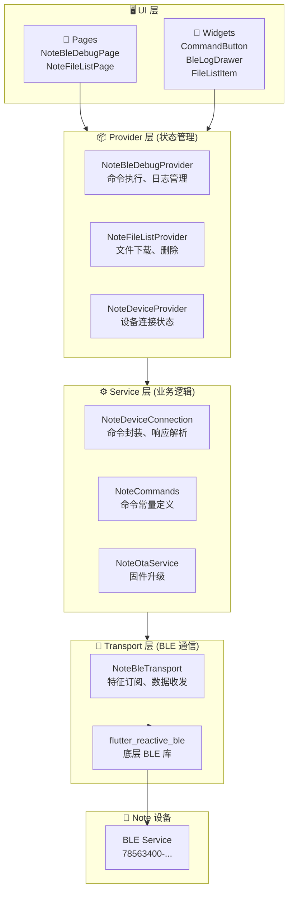
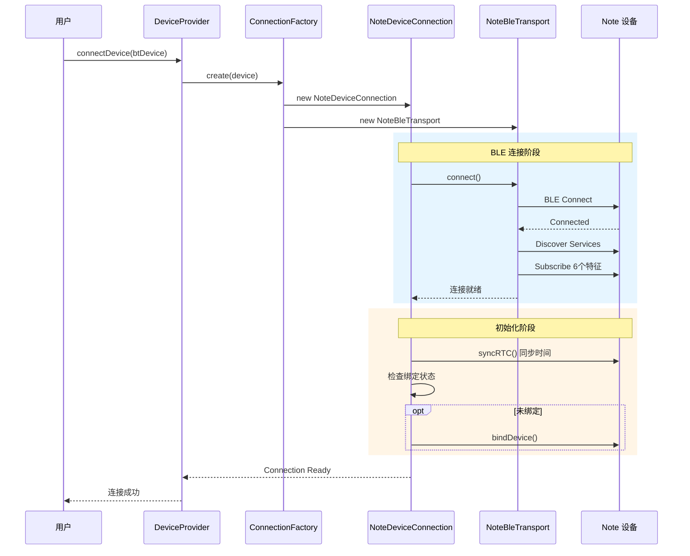
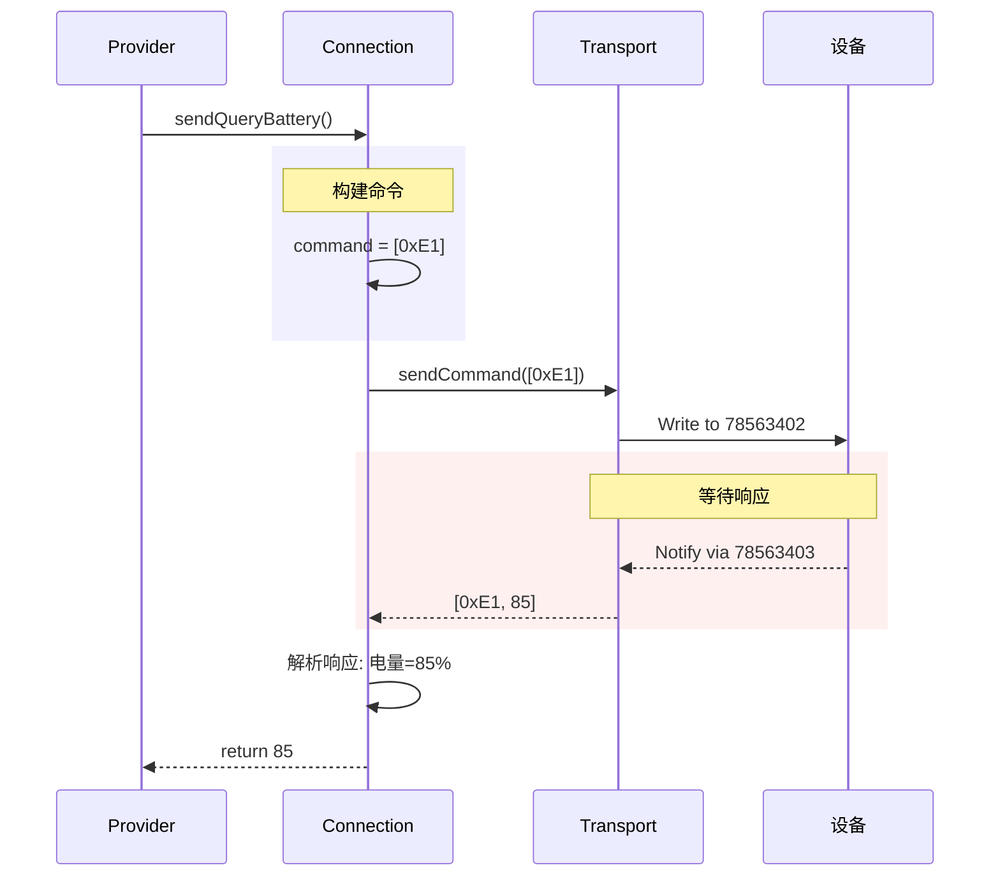
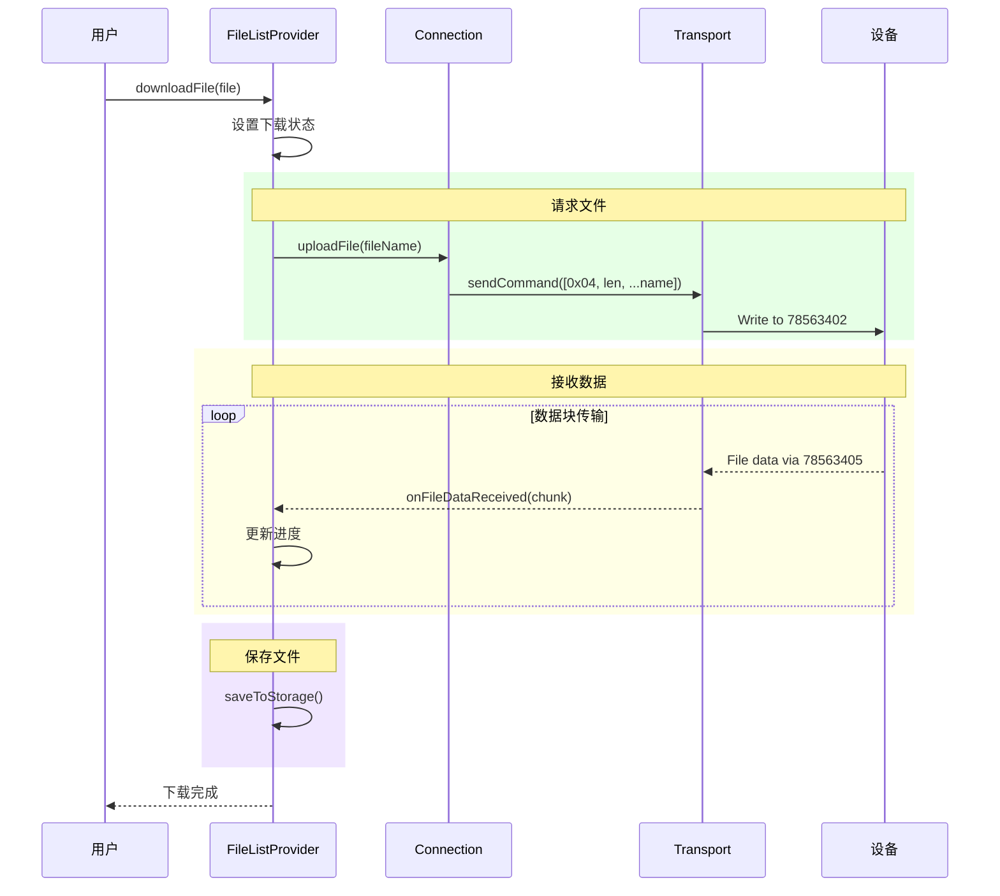
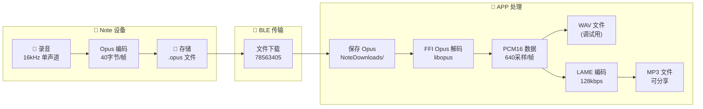
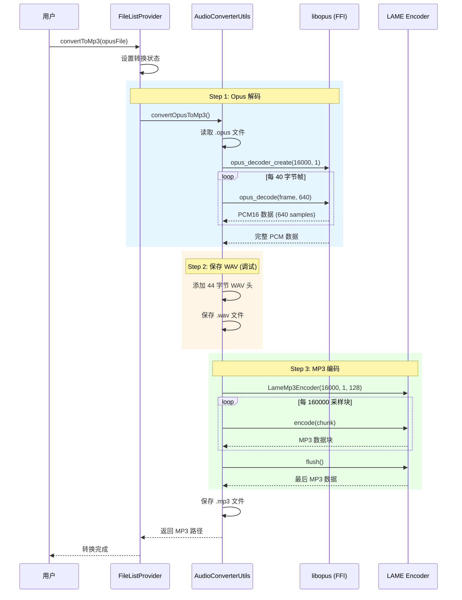

# Note 设备集成快速指南

> **文档类型**: 快速入门指南
> **目标读者**: 需要快速了解 Note 设备集成或开发新功能的开发者
> **详细文档**: [note-device-protocol-migration-plan.md](./note-device-protocol-migration-plan.md)

---

## 目录

- [概述](#概述)
- [整体架构](#整体架构)
- [核心流程](#核心流程)
  - [设备连接流程](#1-设备连接流程)
  - [命令发送流程](#2-命令发送流程)
  - [文件下载流程](#3-文件下载流程)
  - [命令协议速查](#4-命令协议速查)
  - [音频处理流程 (Opus → MP3)](#5-音频处理流程-opus--mp3)
- [Debug 页面功能](#debug-页面功能)
- [快速开发指南](#快速开发指南)
- [关键代码速查](#关键代码速查)

---

## 概述

本文档提供 Note 设备 BLE 通信集成的快速概览，帮助开发者：
- 理解系统架构和数据流向
- 快速定位关键代码位置
- 了解如何添加新功能

### 技术栈
- **BLE 通信**: `flutter_reactive_ble ^5.4.0`
- **状态管理**: Provider
- **架构模式**: 四层架构（UI → Provider → Service → Transport）

---

## 整体架构

### 架构分层图



### 文件结构

```
lib/
├── pages/note_debug/                    # UI 层
│   ├── note_ble_debug_page.dart        # BLE 调试主页面
│   ├── note_file_list_page.dart        # 文件列表页面
│   ├── models/
│   │   └── ble_log_entry.dart          # 日志条目模型
│   └── widgets/
│       ├── command_button.dart         # 命令按钮
│       ├── command_category_section.dart
│       ├── ble_log_drawer.dart         # 日志抽屉
│       └── file_list_item.dart         # 文件列表项
│
├── providers/                           # Provider 层
│   ├── note_ble_debug_provider.dart    # 调试状态管理
│   ├── note_file_list_provider.dart    # 文件列表状态
│   ├── note_device_provider.dart       # 设备连接状态
│   └── note_ota_provider.dart          # OTA 状态
│
├── services/devices/                    # Service 层
│   ├── note_connection.dart            # 设备连接实现
│   ├── note_commands.dart              # 命令和 UUID 定义
│   ├── note_ota_service.dart           # OTA 服务
│   ├── note_storage_manager.dart       # 绑定信息存储
│   └── transports/
│       └── note_ble_transport.dart     # BLE 传输层
│
└── backend/schema/bt_device/
    └── note_device.dart                # 数据模型
```

### BLE 特征 UUID

**Service UUID**: `78563400-ecf0-89b1-c845-2b9e631f4d7a`

| 特征 | UUID | 用途 | 方向 |
|------|------|------|------|
| 音频数据 | 78563401-... | 实时音频流 | 设备→APP |
| 命令下行 | 78563402-... | 发送控制命令 | APP→设备 |
| 设备响应 | 78563403-... | 命令响应/通知 | 设备→APP |
| OTA 文件 | 78563404-... | 固件传输 | APP→设备 |
| 录音文件 | 78563405-... | 文件上传 | 设备→APP |
| 日志文件 | 78563406-... | 日志传输 | 设备→APP |

---

## 核心流程

### 1. 设备连接流程



### 2. 命令发送流程



### 3. 文件下载流程



### 4. 命令协议速查

| 命令 | HEX | 功能 | 响应 |
|------|-----|------|------|
| 开始录音 | 0x01 | 开始录音 | 0x01 0x01 (成功) |
| 停止录音 | 0x02 | 停止录音 | 0x02 0x00 0x01 (成功) |
| 文件列表 | 0x03 | 获取文件列表 | 0x03 + 文件数据 |
| 上传文件 | 0x04 | 请求文件上传 | 文件数据流 |
| 删除文件 | 0x05 | 删除指定文件 | - |
| 设备重启 | 0x09 | 重启设备 | - |
| 设备绑定 | 0x0B | 绑定/解绑 | - |
| 录音模式 | 0x0D | 设置录音模式 | - |
| 查询电量 | 0xE1 | 获取电池电量 | 0xE1 + 电量% |
| 查询版本 | 0xE3 | 获取固件版本 | 0xE3 + 9字节版本 |
| USB 模式 | 0xE4 | 开关 USB 模式 | - |
| RTC 同步 | 0xE5 | 同步时间 | - |
| OTA 进入 | 0xE6 | 进入 OTA 模式 | - |
| 查询存储 | 0xE8 | 获取存储信息 | 0xE8 + 存储数据 |
| 出厂重置 | 0xE9 | 恢复出厂设置 | 0xE9 0x01 |

### 5. 音频处理流程 (Opus → MP3)

Note 设备录音保存为 Opus 格式，下载后可转换为 MP3 便于分享。

> **深入理解**: 关于 PCM 采样、Opus 帧、压缩原理等概念，请参阅 [音频编解码核心概念](./audio-codec-concepts.md)

#### 音频参数

| 参数 | 值 | 说明 |
|------|-----|------|
| 采样率 | 16000 Hz | 16kHz |
| 声道 | 1 (单声道) | Mono |
| Opus 帧大小 | 40 字节 | 压缩后每帧 |
| PCM 帧大小 | 640 采样 | 解码后每帧 (40ms) |
| 位深度 | 16-bit | PCM16 格式 |

#### 数据流图



#### 转换流程详解



#### 关键代码

**文件**: `lib/utils/audio_converter_utils.dart`

```dart
class AudioConverterUtils {
  // Opus 帧参数 (单声道)
  static const int _noteOpusFrameSize = 40;   // 40 字节/帧
  static const int _opusPcmFrameSize = 640;   // 640 采样/帧 (40ms)

  Future<String> convertOpusToMp3({
    required String opusFilePath,
    int sampleRate = 16000,
    int channels = 1,         // 单声道
    bool keepWavFile = true,  // 保留中间 WAV 文件
  });
}
```

**FFI 解码器** (使用 `opus_flutter` 加载 libopus):

```dart
class _OpusDecoderFFI {
  // FFI 函数绑定
  late final OpusDecodeDart _opusDecode;

  Int16List decode(Uint8List encodedData, int frameSize) {
    // 调用 opus_decode() 解码单帧
    final samplesDecoded = _opusDecode(
      _decoder, dataPtr, encodedData.length,
      pcmPtr, frameSize, 0
    );
    return Int16List.fromList(pcmPtr.asTypedList(samplesDecoded * _channels));
  }
}
```

**MP3 编码** (使用 `flutter_lame`):

```dart
final encoder = LameMp3Encoder(
  sampleRate: 16000,
  numChannels: 1,
  bitRate: 128,  // 128 kbps
);

// 分块编码 (每块 10 秒 = 160000 采样)
final mp3Chunk = await encoder.encode(leftChannel: chunk);
final lastChunk = await encoder.flush();
```

#### 输出文件

| 文件类型 | 路径 | 说明 |
|---------|------|------|
| 原始 Opus | `NoteDownloads/{name}.opus` | 从设备下载 |
| 中间 WAV | `NoteDownloads/{name}.wav` | 调试用，可播放验证 |
| 最终 MP3 | `NoteDownloads/{name}.mp3` | 可分享 |

#### 依赖库

```yaml
# pubspec.yaml
dependencies:
  opus_flutter: ^3.0.3      # 加载 libopus native 库
  flutter_lame: ^1.0.3      # LAME MP3 编码
  ffi: ^2.1.0               # Dart FFI 支持

dependency_overrides:
  opus_flutter_ios:
    git:
      url: https://github.com/mdmohsin7/opus_flutter.git
      path: opus_flutter_ios
      ref: dev
  opus_flutter_android:
    git:
      url: https://github.com/mdmohsin7/opus_flutter.git
      path: opus_flutter_android
```

---

## Debug 页面功能

### BLE Debug 页面 (`NoteBleDebugPage`)

```
┌─────────────────────────────────────┐
│  BLE Debug                    📋 ⟨  │  ← 日志按钮带数量徽章
├─────────────────────────────────────┤
│  ● Connected                        │  ← 连接状态
├─────────────────────────────────────┤
│  ▼ Recording                        │
│  ┌─────────────────────────────────┐│
│  │ Start Recording         0x01   ││  ← 命令按钮
│  │ Stop Recording          0x02   ││
│  │ Set Mode ▼              0x0D   ││  ← 带下拉选择
│  └─────────────────────────────────┘│
│  ▼ Device Info                      │
│  ┌─────────────────────────────────┐│
│  │ Query Battery           0xE1   ││
│  │ Query Version           0xE3   ││
│  │ Query Storage           0xE8   ││
│  └─────────────────────────────────┘│
│  ▼ File Management                  │
│  ┌─────────────────────────────────┐│
│  │ File Manager →                 ││  ← 导航到文件列表
│  └─────────────────────────────────┘│
│  ▼ Device Control                   │
│  ▼ OTA                              │
│  ▼ Custom Command                   │
│  ┌─────────────────────────────────┐│
│  │ [0xE1 0x00    ] [Send]         ││  ← 自定义命令输入
│  └─────────────────────────────────┘│
├─────────────────────────────────────┤
│  ▲ BLE Logs (拖动展开)              │
│  12:30:45.123 TX: E1                │  ← 发送的命令
│  12:30:45.156 RX: E1 55             │  ← 接收的响应
│  [Clear]                            │
└─────────────────────────────────────┘
```

**核心功能**:
- 发送预定义命令（按分类组织）
- 发送自定义 HEX 命令
- 实时查看 BLE 通信日志
- 日志支持 TX/RX 方向显示

### 文件列表页面 (`NoteFileListPage`)

```
┌─────────────────────────────────────┐
│  Device Files            🔄  📋 ⟨  │
├─────────────────────────────────────┤
│  ● Connected                        │
├─────────────────────────────────────┤
│  Files (3)                          │
├─────────────────────────────────────┤
│  ┌─────────────────────────────────┐│
│  │ 📄 20250110_143022.pcm          ││
│  │    00:05:32  │  ⬇️  │  🗑️      ││
│  └─────────────────────────────────┘│
│  ┌─────────────────────────────────┐│
│  │ 📄 20250110_150108.pcm          ││
│  │    00:02:15  │  ⬇️  │  🗑️      ││
│  │    ████████░░░░░ 68%            ││  ← 下载进度
│  └─────────────────────────────────┘│
│  ┌─────────────────────────────────┐│
│  │ 📄 20250109_091523.pcm          ││
│  │    00:10:45  │  ⬇️  │  🗑️      ││
│  └─────────────────────────────────┘│
└─────────────────────────────────────┘
```

**核心功能**:
- 显示设备文件列表
- 文件下载（带进度显示）
- 文件删除（带确认对话框）
- 下载路径: `NoteDownloads/` 目录

---

## 快速开发指南

### 添加新命令

**步骤 1**: 在 `note_commands.dart` 添加命令常量

```dart
// lib/services/devices/note_commands.dart
class NoteCommands {
  // ... 现有命令
  static const int newCommand = 0xXX;  // 添加新命令
}
```

**步骤 2**: 在 `note_connection.dart` 添加命令方法

```dart
// lib/services/devices/note_connection.dart
class NoteDeviceConnection {
  /// 新命令描述
  Future<ResultType> sendNewCommand(params) async {
    final command = [NoteCommands.newCommand, ...params];
    final response = await sendCommandWithResponse(command);
    // 解析响应
    return parseResponse(response);
  }
}
```

**步骤 3**: 在 Provider 中暴露方法（可选）

```dart
// lib/providers/note_ble_debug_provider.dart
Future<void> sendNewCommand() async {
  await executeCommand(
    [NoteCommands.newCommand],
    'New Command',
  );
}
```

**步骤 4**: 在 UI 中添加按钮

```dart
// lib/pages/note_debug/note_ble_debug_page.dart
CommandButton(
  title: 'New Command',
  hexCode: '0xXX',
  onPressed: provider.isConnected ? provider.sendNewCommand : null,
  isLoading: provider.isExecuting,
),
```

### 添加新页面

**步骤 1**: 创建 Provider

```dart
// lib/providers/note_xxx_provider.dart
class NoteXxxProvider extends BaseProvider {
  NoteDeviceConnection? _connection;

  void setConnection(NoteDeviceConnection? connection) {
    _connection = connection;
    notifyListeners();
  }

  // 业务方法
  Future<void> doSomething() async {
    if (_connection == null) return;
    await _connection!.sendXxxCommand();
  }
}
```

**步骤 2**: 在 main.dart 注册 Provider

```dart
// lib/main.dart
MultiProvider(
  providers: [
    // ... 现有 providers
    ChangeNotifierProvider(create: (_) => NoteXxxProvider()),
  ],
)
```

**步骤 3**: 创建页面

```dart
// lib/pages/note_debug/note_xxx_page.dart
class NoteXxxPage extends StatefulWidget {
  @override
  State<NoteXxxPage> createState() => _NoteXxxPageState();
}

class _NoteXxxPageState extends State<NoteXxxPage> {
  @override
  void initState() {
    super.initState();
    WidgetsBinding.instance.addPostFrameCallback((_) async {
      // 获取连接
      final deviceProvider = context.read<DeviceProvider>();
      final xxxProvider = context.read<NoteXxxProvider>();

      if (deviceProvider.connectedDevice != null) {
        final connection = await ServiceManager.instance()
            .device.ensureConnection(deviceProvider.connectedDevice!.id);
        if (connection is NoteDeviceConnection) {
          xxxProvider.setConnection(connection);
        }
      }
    });
  }

  @override
  Widget build(BuildContext context) {
    return Consumer<NoteXxxProvider>(
      builder: (context, provider, child) {
        return Scaffold(
          // 页面内容
        );
      },
    );
  }
}
```

---

## 关键代码速查

| 功能 | 文件 | 关键方法/类 |
|------|------|------------|
| **连接设备** | `note_connection.dart` | `connect()`, `_initialize()` |
| **发送命令** | `note_connection.dart` | `sendCommandWithResponse()` |
| **订阅特征** | `note_ble_transport.dart` | `_discoverAndSubscribe()` |
| **命令定义** | `note_commands.dart` | `NoteCommands`, `NoteUUIDs` |
| **日志记录** | `note_ble_debug_provider.dart` | `_addLogEntry()` |
| **文件下载** | `note_file_list_provider.dart` | `downloadFile()`, `_onFileDataReceived()` |
| **音频转换** | `audio_converter_utils.dart` | `convertOpusToMp3()`, `_OpusDecoderFFI` |
| **OTA 升级** | `note_ota_service.dart` | `transferFirmware()`, `triggerUpgrade()` |
| **设备绑定** | `note_storage_manager.dart` | `saveDeviceBinding()`, `getDeviceBinding()` |

### Provider 方法速查

| Provider | 方法 | 功能 |
|----------|------|------|
| `NoteBleDebugProvider` | `sendQueryBattery()` | 查询电量 |
| | `sendQueryVersion()` | 查询版本 |
| | `sendCustomCommand(hex)` | 发送自定义命令 |
| | `clearLogs()` | 清除日志 |
| `NoteFileListProvider` | `refreshFileList()` | 刷新文件列表 |
| | `downloadFile(file)` | 下载文件 |
| | `deleteFile(file)` | 删除文件 |
| | `cancelDownload()` | 取消下载 |
| | `convertToMp3(path)` | Opus 转 MP3 |
| `NoteDeviceProvider` | `connectDevice(device)` | 连接设备 |
| | `disconnectDevice()` | 断开连接 |
| | `refreshDeviceInfo()` | 刷新设备信息 |

---

## 参考链接

- **详细实施文档**: [note-device-protocol-migration-plan.md](./note-device-protocol-migration-plan.md)
- **BLE 库文档**: [flutter_reactive_ble](https://pub.dev/packages/flutter_reactive_ble)
- **项目主文档**: [CLAUDE.md](../CLAUDE.md)

---

**文档版本**: v1.0
**创建日期**: 2025-01-10
**维护者**: Omi Team
