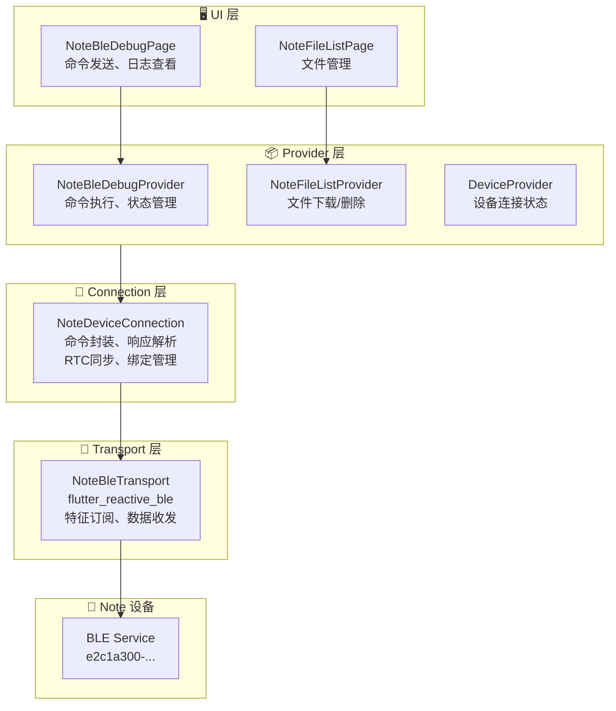
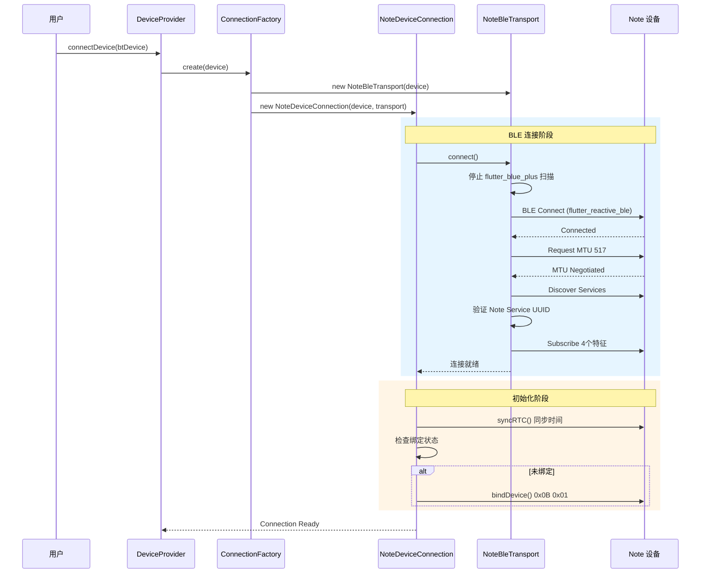
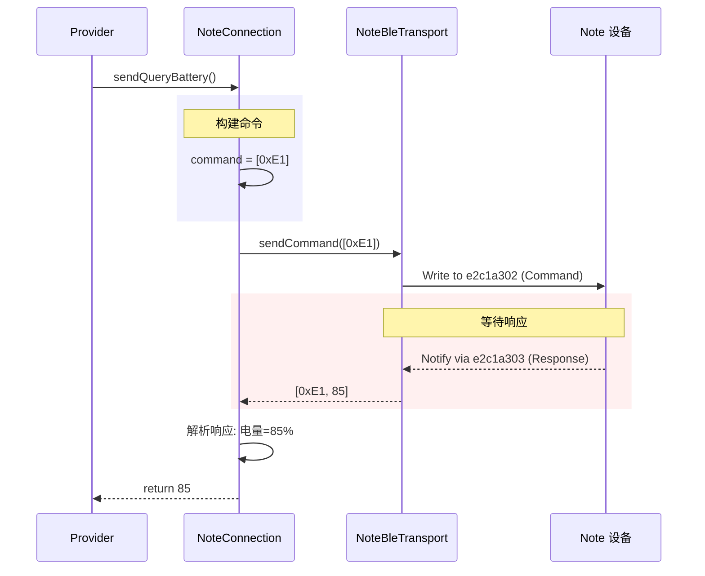
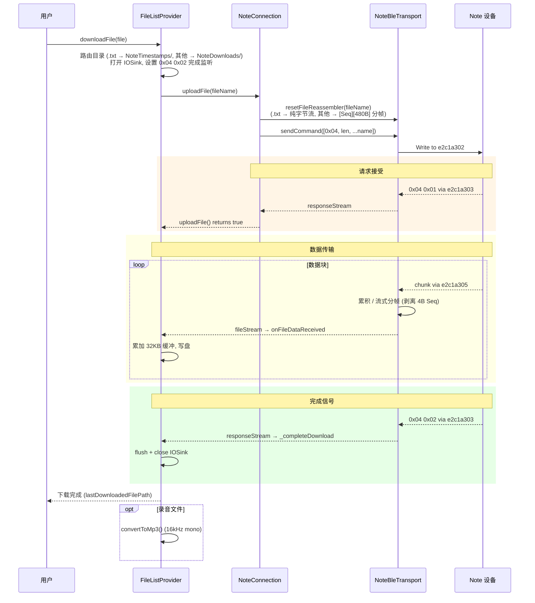
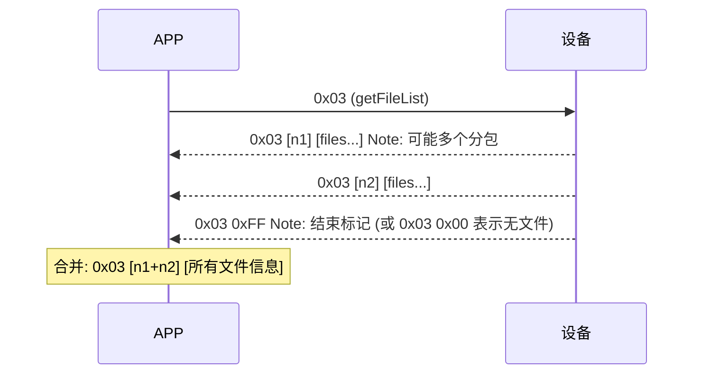
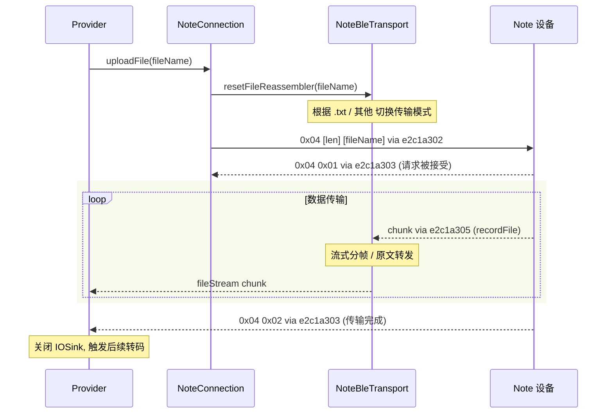
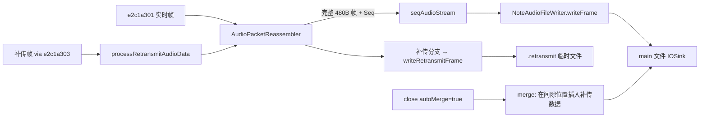
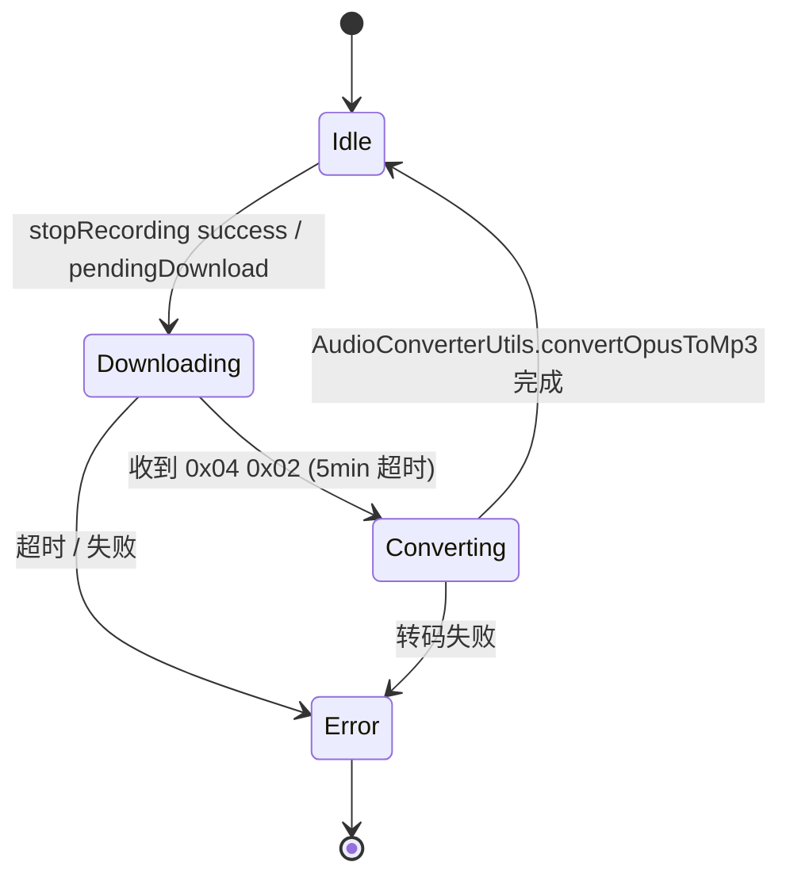

# BLE 功能 API 文档 (Note 设备)

> **文档类型**: API 参考文档
> **目标读者**: 需要集成、维护或扩展 Note 设备 BLE 功能的开发者
> **相关文档**: [Note 设备快速指南](./note-device-quick-guide.md)

---

## 目录

- [概述](#概述)
- [整体架构](#整体架构)
- [Note 设备通信流程](#note-设备通信流程)
- [Note 设备 API 参考](#note-设备-api-参考)
- [Debug 页面功能](#debug-页面功能)
- [BLE 特征 UUID 参考](#ble-特征-uuid-参考)
- [命令协议速查](#命令协议速查)
- [文件传输协议详解](#文件传输协议详解)
- [关键代码速查](#关键代码速查)

---

## 概述

本文档提供 Note 设备 BLE 通信功能的 API 参考。Note 设备使用 `flutter_reactive_ble` 库实现 BLE 通信，与其他设备（使用 `flutter_blue_plus`）的实现有所不同。

### 技术栈

| 组件 | 技术 | 说明 |
|------|------|------|
| BLE 通信 | `flutter_reactive_ble ^5.4.0` | Note 设备专用 |
| 状态管理 | Provider | NoteBleDebugProvider |
| 架构模式 | 四层架构 | UI → Provider → Connection → Transport |
| 音频编解码 | Opus | 16kHz 单声道 |

---

## 整体架构

### 架构分层图



### 文件结构

```
lib/
├── pages/note_debug/
│   ├── note_ble_debug_page.dart       # BLE 调试页面
│   ├── note_file_list_page.dart       # 文件列表页面
│   ├── models/
│   │   └── ble_log_entry.dart         # 日志模型
│   └── widgets/
│       ├── command_button.dart        # 命令按钮
│       ├── command_category_section.dart
│       ├── ble_log_drawer.dart        # 日志抽屉
│       └── file_list_item.dart        # 文件项
│
├── providers/
│   ├── note_ble_debug_provider.dart   # Debug 状态管理
│   ├── note_file_list_provider.dart   # 文件列表状态
│   └── note_device_provider.dart      # 设备状态
│
├── services/devices/
│   ├── note_connection.dart           # Note 设备连接 (含分包合并、补传、重连恢复)
│   ├── note_commands.dart             # 命令/UUID/V1.0 协议常量/枚举
│   ├── note_ota_service.dart          # OTA 服务
│   ├── note_storage_manager.dart      # 绑定信息 + 补传状态持久化
│   ├── note_audio_file_writer.dart    # 实时音频文件写入 + 补传合并
│   ├── note_timestamp_file.dart       # .txt 时间戳文件独立目录管理
│   └── transports/
│       └── note_ble_transport.dart    # BLE 传输层 + AudioPacketReassembler
│
└── backend/schema/bt_device/
    └── note_device.dart               # 数据模型
```

---

## Note 设备通信流程

### 1. 设备连接流程



### 2. 命令发送流程



### 3. 文件下载流程



---

## Note 设备 API 参考

### NoteDeviceConnection

**文件**: `lib/services/devices/note_connection.dart`

#### 设备信息查询

| 方法 | 返回值 | 说明 |
|------|--------|------|
| `performRetrieveBatteryLevel()` | `Future<int>` | 查询电量 (0-100) |
| `queryFirmwareVersion()` | `Future<String>` | 查询固件版本 (vX.Y.Z) |
| `queryStorage()` | `Future<NoteStorageInfo>` | 查询存储空间 |

#### 录音控制

| 方法 | 返回值 | 说明 |
|------|--------|------|
| `startRecording()` | `Future<bool>` | 开始录音 |
| `stopRecording()` | `Future<Map>` | 停止录音，返回文件信息 |
| `setRecordingMode(mode)` | `Future<void>` | 设置录音模式 |

#### 文件管理

| 方法 | 返回值 | 说明 |
|------|--------|------|
| `getFileList()` | `Future<List<NoteFileInfo>>` | 获取文件列表（含分包合并） |
| `uploadFile(fileName)` | `Future<bool>` | 请求文件上传（仅返回是否被接受，完成需监听 `0x04 0x02`） |
| `deleteFile(fileName)` | `Future<bool>` | **按文件名删除**（旧版按索引，已废弃） |
| `getFileDataListener({onFileDataReceived})` | `Future<StreamSubscription?>` | 订阅 fileStream |
| `requestRetransmit(name, startSeq, endSeq)` | `Future<bool>` | V1.0 补传请求 (0x20) |
| `getSeqGaps()` / `clearSeqGaps()` | `List<SeqGapRecord>` / `void` | 实时音频 Seq 间隙记录 |
| `resetAudioReassembler({fileName})` | `void` | 实时音频重组器重置 |
| `queryRecordStatus()` | `Future<RecordStatus>` | 主动读取 `e2c1a310` 状态 |

#### 设备管理

| 方法 | 返回值 | 说明 |
|------|--------|------|
| `syncRTC()` | `Future<void>` | 同步 RTC 时间 |
| `bindDevice()` | `Future<void>` | 绑定设备 |
| `unbindDevice()` | `Future<void>` | 解绑设备 |
| `setUsbMode(enabled)` | `Future<void>` | 开关 U盘模式 |
| `reboot()` | `Future<void>` | 设备重启 |
| `factoryReset(keepRecordings)` | `Future<bool>` | 恢复出厂设置 |

#### 使用示例

```dart
// 获取 Note 设备连接
final connection = await ServiceManager.instance()
    .device.ensureConnection(deviceId);

if (connection is NoteDeviceConnection) {
  // 查询电量
  final battery = await connection.performRetrieveBatteryLevel();
  print('Battery: $battery%');

  // 查询版本
  final version = await connection.queryFirmwareVersion();
  print('Version: $version');

  // 开始录音
  final success = await connection.startRecording();

  // 获取文件列表
  final files = await connection.getFileList();
  for (final file in files) {
    print('${file.name} - ${file.durationSeconds}s');
  }
}
```

### NoteBleTransport

**文件**: `lib/services/devices/transports/note_ble_transport.dart`

#### 数据流

| 属性 | 类型 | 说明 |
|------|------|------|
| `audioStream` | `Stream<List<int>>` | 实时音频数据流 (`e2c1a301`)，已剥离 Seq/Flag，输出 480B Opus 帧 |
| `seqAudioStream` | `Stream<({int seq, List<int> frame})>` | 带 Seq 的实时音频流（供文件写入器使用） |
| `responseStream` | `Stream<List<int>>` | 响应数据流 (`e2c1a303`) — 含 unsolicited 通知、补传响应 |
| `fileStream` | `Stream<List<int>>` | 文件数据流 (`e2c1a305`) — 已按模式自动处理 (.txt 原文 / .opus 剥离 Seq 后的 480B 帧) |
| `logStream` | `Stream<List<int>>` | 日志数据流 (`e2c1a306`) |
| `seqGaps` | `List<SeqGapRecord>` | 实时音频 Seq 间隙记录（最多保留 100 条） |
| `negotiatedMtu` | `int` | 协商的 MTU 值（默认请求 517） |
| `lastCompletedSeq` / `completedFrameCount` | `int` | 重组器统计 |

#### 方法

| 方法 | 说明 |
|------|------|
| `connect()` | 连接设备 (MTU协商 + 服务发现 + 特征订阅 6 个 notify + 1 个 read) |
| `disconnect()` | 断开连接 (重置重组器、清理 GATT 缓存) |
| `sendCommand(command)` | 发送命令到 `e2c1a302` (无响应写入) |
| `sendOtaData(data)` | 发送 OTA 数据到 `e2c1a304` (有响应写入) |
| `processRetransmitAudioData(packet)` | 把 `e2c1a303` 上来的补传数据帧交给 `_reassembler` 重组 |
| `resetFileReassembler({fileName})` | 重置文件传输状态，按 `.txt` 后缀切换 raw/分帧模式 |
| `resetReassembler({fileName})` | 重置实时音频重组器 |
| `restoreLastCompletedSeq(seq)` | 重连后恢复 Seq 状态以驱动间隙检测 |
| `clearSeqGaps()` | 清空 Seq 间隙记录 |
| `readCharacteristic(svc, char)` | 主动读取（用于 `e2c1a310` 录音状态查询） |

---

## Debug 页面功能

### 功能概览

Debug 页面 (`NoteBleDebugPage`) 提供以下功能模块：

| 模块 | 功能 | 实现方式 |
|------|------|----------|
| **Recording** | 录音控制 | `startRecording()` / `stopRecording()` — 停止后**自动**触发下载 + MP3 转码 |
| **Device Info** | 设备信息查询 | `queryBattery()` / `queryVersion()` / `queryStorage()` |
| **File Management** | 文件管理 | 跳转到 `NoteFileListPage`（含 .txt 时间戳文件） |
| **Auto Download & Convert** | 录音文件自动下载 + Opus→MP3 转码 | `_startDownloadAndConvert()` — 由 `sendStopRecording` / `onRecordingStopped` / `onPendingDownloads` 触发 |
| **Reconnect Recovery** | 断连恢复 + 待下载文件 | `_setupPendingDownloadListener()` — 监听 `onPendingDownloads` |
| **Retransmit Test** | V1.0 补传协议验证 | `testRetransmit(name, startSeq, endSeq)` / `simulateDisconnect()` |
| **Device Control** | 设备控制 | 绑定/解绑/U盘模式/重启/恢复出厂 |
| **OTA** | 固件升级 | 进入 OTA 模式 |
| **Custom Command** | 自定义命令 | 发送任意 HEX 命令 |

### 功能详细列表

#### Recording (录音控制)

| 按钮 | 命令 | Provider 方法 | 说明 |
|------|------|---------------|------|
| Start Recording | `0x01 0x00 0x00` | `sendStartRecording()` | 开始录音；返回结构化结果 `RecordingStartResult.{success, alreadyRecording, failed}` |
| Stop Recording | `0x02 0x00` | `sendStopRecording()` | 停止录音；**成功后自动调用 `_startDownloadAndConvert(fileName)`** |
| Set Recording Mode | `0x0D + mode` | `sendSetRecordingMode(mode)` | 推流策略: `recordOnly`(0x01) / `recordAndUpload`(0x10) |

> 录音业务类型 (`NoteRecordingType.normal/memo`) 由设备按键决定，APP 不可设置；从 0x01 通知 byte[3] 解析。

#### Auto Download & MP3 Conversion (新增)

| 阶段 | 状态字段 | 说明 |
|------|---------|------|
| `downloading` | `_downloadConvertStage = downloading` | 写盘 + 监听 `0x04 0x02` 完成信号；超时 5 分钟 |
| `converting` | `_downloadConvertStage = converting` | `AudioConverterUtils.convertOpusToMp3` 转码（16kHz mono） |
| 完成 | `_convertedMp3Path` | MP3 文件绝对路径 |
| 失败 | `_downloadConvertError` | 异常信息 |

**触发源**:
- `sendStopRecording()` 成功后（手动停止）
- `onRecordingStopped` 事件流（设备主动停止 / split 续录）
- `onPendingDownloads` 事件流（重连后历史文件）

#### Retransmit Test (新增)

| 方法 | 说明 |
|------|------|
| `testRetransmit(fileName, startSeq, endSeq)` | 手动发起补传请求 (0x20)，用于验证补传数据格式 |
| `simulateDisconnect()` | 主动断开 BLE，保留 Seq 状态，配合后续重连测试补传 |
| `lastCompletedSeq` / `completedFrameCount` / `seqGaps` | 暴露重组器统计供 Debug UI |

#### Device Info (设备信息)

| 按钮 | 命令 | Provider 方法 | 响应解析 |
|------|------|---------------|----------|
| Query Battery | `0xE1` | `sendQueryBattery()` | 返回电量百分比 |
| Query Version | `0xE3` | `sendQueryVersion()` | 返回 9 字节版本号 |
| Query Storage | `0xE8` | `sendQueryStorage()` | 返回 已用KB/总KB |

#### Device Control (设备控制)

| 按钮 | 命令 | Provider 方法 | 说明 |
|------|------|---------------|------|
| Sync RTC | `0xE5 + 4字节时间戳` | `sendSyncRTC()` | 同步系统时间 |
| Bind Device | `0x0B 0x01` | `sendBindDevice()` | 绑定设备 |
| Unbind Device | `0x0B 0x00` | `sendUnbindDevice()` | 解绑设备 |
| USB Mode ON | `0xE4 0x01` | `sendSetUsbMode(true)` | 开启 U盘模式 |
| USB Mode OFF | `0xE4 0x00` | `sendSetUsbMode(false)` | 关闭 U盘模式 |
| Reboot | `0x09` | `sendReboot()` | 设备重启 |
| Factory Reset (Keep) | `0xE9 0x00` | `sendFactoryReset(true)` | 恢复出厂 (保留文件) |
| Factory Reset (Delete) | `0xE9 0xFF` | `sendFactoryReset(false)` | 恢复出厂 (删除文件) |

#### OTA (固件升级)

| 按钮 | 命令 | Provider 方法 | 说明 |
|------|------|---------------|------|
| Enter OTA (8711) | `0xE6 0x04` | `sendOtaEnter(module8711)` | 进入主控模块 OTA |
| Enter OTA (3085) | `0xE6 0x01` | `sendOtaEnter(module3085)` | 进入 WiFi/蓝牙模块 OTA |

#### Custom Command (自定义命令)

```dart
// 支持格式:
// "E1"
// "0xE1"
// "E1 00"
// "0xE1 0x00"

provider.sendCustomCommand("E1 00");
```

### Debug 页面 UI 布局

```
┌─────────────────────────────────────┐
│  BLE Debug                    📋 ⟨  │  ← 日志按钮带数量徽章
├─────────────────────────────────────┤
│  ● Connected                        │  ← 连接状态
├─────────────────────────────────────┤
│  ▼ Recording                        │
│  ┌─────────────────────────────────┐│
│  │ Status: Idle / Recording       ││  ← 录音状态指示
│  │ Start Recording         0x01   ││
│  │ Stop Recording          0x02   ││
│  │ Set Mode ▼              0x0D   ││  ← 下拉选择模式
│  └─────────────────────────────────┘│
│  ▼ Device Info                      │
│  ┌─────────────────────────────────┐│
│  │ Query Battery    [85%]  0xE1   ││  ← 显示查询结果
│  │ Query Version [v1.0.0]  0xE3   ││
│  │ Query Storage [1/8 MB]  0xE8   ││
│  └─────────────────────────────────┘│
│  ▼ File Management                  │
│  ┌─────────────────────────────────┐│
│  │ File Manager →                 ││  ← 跳转文件列表
│  └─────────────────────────────────┘│
│  ▼ Device Control                   │
│  ▼ OTA                              │
│  ▼ Custom Command                   │
│  ┌─────────────────────────────────┐│
│  │ [0xE1 0x00    ] [Send]         ││  ← 自定义命令输入
│  └─────────────────────────────────┘│
├─────────────────────────────────────┤
│  ▲ BLE Logs (拖动展开)              │
│  12:30:45.123 TX: E1                │  ← 发送的命令
│  12:30:45.156 RX: E1 55             │  ← 接收的响应
│  [Clear]                            │
└─────────────────────────────────────┘
```

---

## BLE 特征 UUID 参考

**Service UUID**: `e2c1a300-7f4b-5e9d-bc23-1a2f3e4d5c6b`

> 历史 UUID `78563400-ecf0-89b1-c845-2b9e631f4d7a` 已废弃，固件已切换到 `e2c1a30x` 命名空间。代码中以 `NoteUUIDs.uuidPre = "e2c1a30"` 统一拼接。

| 特征 | UUID | 用途 | 方向 | 备注 |
|------|------|------|------|------|
| 音频数据 | `e2c1a301-...` | 实时音频流 | 设备→APP | Notify, V1.0 [Seq][Flag][Data] 协议 |
| 命令下行 | `e2c1a302-...` | 发送控制命令 | APP→设备 | Write Without Response |
| 设备响应 | `e2c1a303-...` | 命令响应/通知 | 设备→APP | Notify, 含 unsolicited 通知 |
| OTA 文件 | `e2c1a304-...` | 固件传输 | APP→设备 | Write With Response |
| 录音文件 | `e2c1a305-...` | 文件上传 | 设备→APP | Notify, 含 .opus 分帧 / .txt 原文 |
| 日志文件 | `e2c1a306-...` | 日志传输 | 设备→APP | Notify |
| 录音状态 | `e2c1a310-...` | 录音状态查询 | 设备→APP | **Read**, 重连时主动读取 |

**录音状态 (recordStatus, e2c1a310) 数据格式**:

```
[Status 1B] [FileNameLen 1B] [FileName 变长]
- Status: 0x00=未录音 / 0x01=录音中
- FileName: 当前正在录音的文件名 (未录音时为空)
```

由 APP 重连后调用 `queryRecordStatus()` 主动读取，用于决定补传策略（详见“重连后处理”）。

---

## 命令协议速查

| 命令 | HEX | 功能 | 响应格式 |
|------|-----|------|----------|
| 开始录音 | `0x01 0x00 0x00` | 开始录音 | `0x01 0x01 [state] [mode] [filename...]` 见下方"录音控制协议详解" |
| 停止录音 | `0x02 0x00` | 停止录音 | `0x02 0x00 [result] [fileId] [filename...]` 见下方"录音控制协议详解" |
| 文件列表 | `0x03` | 获取文件列表 | 多包合并 — 见下方"文件传输协议详解 / 文件列表分包" |
| 上传文件 | `0x04 [len] [name]` | 请求文件上传(下载到 APP) | `0x04 0x01`(开始) → 文件流 → `0x04 0x02`(完成) |
| 删除文件 | `0x05 [len] [name]` | **按文件名删除** | `0x05 0x01`(成功) / `0x05 0x00`(失败) |
| 设备重启 | `0x09` | 重启设备 | - |
| 设备绑定 | `0x0B 0x01/0x00 [6B macId]` | 绑定/解绑 | `0x0B [op] [0x01]`(成功) |
| 录音模式 | `0x0D [mode]` | 设置录音模式 | `0x0D [mode] [0x01]`(成功) — mode: 0x01=仅录音, 0x10=边录边传 |
| **补传请求** | **`0x20 [len] [name] [startSeq 4B] [endSeq 4B]`** | **音频帧补传 (V1.0)** | 数据 via `e2c1a301`，完成 via `e2c1a303` |
| 补传错误-无文件 | `0x21` | 设备返回 — 文件不存在 | (设备主动) |
| 补传错误-越界 | `0x22` | 设备返回 — Seq 范围无效 | (设备主动) |
| 查询电量 | `0xE1` | 获取电池电量 | `0xE1 [battery%] [chargingState]` (chargingState 可选: 1=充电中/2=未充/3=已充满) |
| 查询版本 | `0xE3` | 获取固件版本 | `0xE3 [version ASCII...]` (变长，过滤非打印字符) |
| U盘模式 | `0xE4 0x01/0x00` | 开关 U盘模式 | - |
| RTC 同步 | `0xE5 [4B timestamp]` | 同步时间 | - |
| 进入 OTA | `0xE6 [module]` | 进入 OTA 模式 | module: 0x01=3085, 0x04=8711 |
| 查询存储 | `0xE8` | 获取存储信息 | `0xE8 [len] [fileCount] [usedKB/totalKB ASCII]` |
| 出厂重置 | `0xE9 0x00/0xFF` | 恢复出厂设置 | `0xE9 0x01` (成功) |

### 录音控制协议详解

#### 开始录音 (0x01)

**命令:** `[0x01, 0x00, 0x00]` (3 字节，第 2/3 字节为预留参数)

**响应格式:** `[Cmd][Op][RecordState][Mode][FileName...]`

```
01 01 01 00 32 30 32 36 30 34 30 35 5f 30 39 30 33 35 38 5f 31 2e 6f 70 75 73
│  │  │  │  └────────────────────────────────────────────────────────────────┘
│  │  │  │   FileName (直到包尾) = "20260405_090358_1.opus"
│  │  │  └── Mode: 0x00=Normal(长按), 0x01=Memo(短按)
│  │  └───── RecordState: 通常 0x01
│  └──────── Op: 0x01=开始录音
└─────────── Cmd: 0x01
```

| 字段 | 偏移 | 大小 | 说明 |
|------|:----:|:----:|------|
| Cmd | 0 | 1B | 0x01 (录音控制) |
| Op | 1 | 1B | 0x01=开始录音 |
| RecordState | 2 | 1B | 设备录音状态码，通常 0x01 |
| **Mode** | **3** | **1B** | **录音业务类型: `0x00=Normal` / `0x01=Memo`** (见 [`NoteRecordingType`](../lib/services/devices/note_commands.dart)) |
| FileName | 4 | 变长 | 录音文件名 (ASCII, 直到包尾) |

**注意:**
- 开始录音响应**无 FileID 字段**，FileName 紧跟在 Mode 之后。
- 该响应**也可能是 unsolicited** — 用户在设备上按键 / 录音超时 split 续录都会触发；APP 通过 `_responseCompleter` 是否存在来区分主动 vs 被动。
- 失败响应: `01 00 01` — 设备已在录音 (`RecordingStartResult.alreadyRecording`)

#### 停止录音 (0x02)

**命令:** `[0x02][Op]`
- Op: 0x00=结束录音, 0x01=继续录音, 0x02=暂停录音

**响应格式:** `[Cmd][Op][Result][FileID][FileName...]`

```
02 00 01 06 32 30 32 36 30 34 30 35 5f 31 31 30 30 33 33 5f 31 2e 6f 70 75 73
│  │  │  │  └─────────────────────────────────────────────────────────────────┘
│  │  │  │   FileName (直到包尾) = "20260405_110033_1.opus"
│  │  │  └── FileID: 0x06 (��备全局文件计数，从 1 递增)
│  │  └───── Result: 0x01=成功, 0x02=文件异常, 0x03=超时分片
│  └──────── Op: 0x00=结束录音 (回显)
└─────────── Cmd: 0x02
```

| 字段 | 偏移 | 大小 | 说明 |
|------|:----:|:----:|------|
| Cmd | 0 | 1B | 0x02 (录音控制) |
| Op | 1 | 1B | 操作码回显 (0x00/0x01/0x02) |
| Result | 2 | 1B | 0x01=成功, 0x02=文件异常, 0x03=超时分片 |
| FileID | 3 | 1B | 设备全局文件计数器，每产生一个文件 +1，重启前不重置 |
| FileName | 4 | 变长 | 录音文件名 (ASCII, 直到包尾) |

**重���: 设备会主动发送停止录音响应。** 当录音���超时或分片���制自动结束时，设备会主动发送与手动停止相同格式的 `0x02` 响应（unsolicited notification），APP 端无前置命���。

#### 实测样本 (2026-04-04 ~ 2026-04-05)

| 时间 | 触发方式 | FileID | FileName | 原始 HEX |
|------|---------|:------:|----------|----------|
| 04/04 15:01 | 手动停止 | 0x02 | 20260404_150113_1.opus | `02 00 01 02 32...` |
| 04/05 09:03 | 手动停止 memo | 0x03 | 20260405_090358_1.opus | `02 00 01 03 32...` |
| 04/05 10:50 | 设备主动停止 | 0x05 | 20260405_105038_1.opus | `02 00 01 05 32...` |
| 04/05 11:00 | 手动停止 memo | 0x06 | 20260405_110033_1.opus | `02 00 01 06 32...` |

**观察:** FileID 跨天持续递增 (2→3→5→6)，中间缺失的 4 说明有一次�����未被捕获。

### 录音模式枚举

```dart
/// 上行行为：录音的同时是否实时通过 a301 推流 (0x0D 命令的参数)
enum NoteRecordingMode {
  recordOnly(0x01),       // 仅录音
  recordAndUpload(0x10);  // 边录边传
}
```

### 录音业务类型枚举 (NoteRecordingType)

> **维度独立** — 与 `NoteRecordingMode`（推流策略）互不影响。`NoteRecordingType` 由设备按键决定，APP 不可指定，仅在通知/查询响应中读取。

```dart
enum NoteRecordingType {
  normal(0x00),  // 普通录音 — 长按 2.5s 触发，时长不限
  memo(0x01);    // 备忘录/灵感速记 — 关闭录音状态下短按触发，固定 ≤60s
}
```

**Mode 字节出现位置**:

| 出现场景 | 报文 | Mode 偏移 |
|---------|------|----------|
| 0x01 开始录音成功 | `01 01 [state] [mode] [filename...]` | byte[3] |
| `e2c1a310` 录音状态查询 | `[status] [nameLen] [filename]` | (Mode 不在此响应里，需结合 0x01 通知) |
| Split 续录 unsolicited 通知 | `01 01 [state] [mode] [filename...]` | byte[3] |

**APP 持久化**: `_storage.appendRecordingMode(fileName, type)` — 将 (fileName → mode) 索引落盘，供后续业务关联。

### 补传协议枚举 (V1.0)

```dart
class NoteCommands {
  static const int retransmitRequest        = 0x20;  // 补传请求 / 数据 / 完成通知
  static const int retransmitErrorNoFile    = 0x21;  // 文件不存在
  static const int retransmitErrorBadRange  = 0x22;  // Seq 范围无效
}
```

### OTA 模块类型

```dart
enum NoteOtaModule {
  module3085(0x01), // WiFi/蓝牙模块
  module8711(0x04); // 主控模块
}
```

---

## 文件传输协议详解

> 本章是 V1.0 协议中所有"文件传输 / 文件流"的权威说明，覆盖：
> 1. 录音文件的设备→APP 上传（即 APP 视角的"下载"）
> 2. .txt 时间戳文件的纯字节流传输
> 3. 实时录音流式写入（边录边写本地）+ 间隙补传 + 文件合并
> 4. 文件列表分包合并、删除、断连恢复
>
> 涉及的特征：
> - **`e2c1a302`** (command, APP→设备): 触发文件操作的命令通道
> - **`e2c1a303`** (response, 设备→APP): 控制响应、分包、补传完成通知
> - **`e2c1a305`** (recordFile, 设备→APP): 录音文件 / .txt 文件数据流
> - **`e2c1a301`** (audioData, 设备→APP): 实时音频帧 + 补传数据帧

### 1. 文件列表分包合并 (0x03)

设备返回文件列表时**可能拆成多个 BLE notification**，APP 在 `NoteDeviceConnection._handleIncomingPacket` 中合并：



**分包识别逻辑** (`note_connection.dart:158-174`):
- `packet[1] == 0x00` → 没有任何文件，直接结束
- `packet[1] == 0xFF` → 终止符，立即合并已收集的所有分包
- `packet.length > 2` → 数据分包，加入缓冲并启动 **500ms 超时**
- 超时未收到下一个分包 → 自动调用 `_completeFileListResponse()` 兜底

**合并算法** (`note_connection.dart:279-312`):
```
output = [0x03]
totalCount = 0
for each packet in _fileListPackets:
    totalCount += packet[1]                  // 本包文件数
    output.addAll(packet[2..])               // 跳过 cmd + count
output.insert(1, totalCount)                 // 总文件数前置
```

**单条文件信息布局** (`note_connection.dart:826-845`):

| 字段 | 偏移 | 大小 | 说明 |
|------|:----:|:----:|------|
| index | 0 | 1B | 设备内部索引 |
| duration | 1 | 2B (Big-Endian) | 录音时长（秒） |
| nameLen | 3 | 1B | 文件名长度 |
| name | 4 | nameLen | 文件名 (UTF-8) |

**文件名校验**: 长度 ≥15 且包含 `_` 才视为合法（过滤掉损坏数据）。

### 2. 文件下载（设备 → APP 上传）(0x04)



**关键点**:
- **请求接受**: `0x04 0x01` — `uploadFile()` 在此返回 `true`
- **传输失败**: `0x04 0x00` — 文件不存在
- **传输完成**: `0x04 0x02` — APP 必须**单独监听 responseStream** 才能感知（`uploadFile()` 不会等待此信号）。NoteFileListProvider 通过 `_setupCompletionListener()` 监听。

#### 文件流双模式 (`note_ble_transport.dart:365-373, 778-803`)

设备发送的文件数据格式取决于文件类型，APP 在调用 `uploadFile()` 前会通过 `resetFileReassembler(fileName: ...)` 设置模式：

| 模式 | 触发条件 | BLE notification 内容 | APP 处理 |
|------|---------|---------------------|---------|
| **纯字节流** (`_isRawFileTransfer = true`) | 文件名以 `.txt` 结尾 | 直接是文件原始字节 | 原样写入磁盘 |
| **音频分帧** (`_isRawFileTransfer = false`) | 其他扩展名 (`.opus` 等) | `[Seq 4B][Audio 480B]` × N，**chunk 边界与 BLE 通知不对齐** | 流式分帧，剥离 4B Seq 后输出 480B 数据 |

**音频分帧实现**:
```dart
_fileChunkBuffer.addAll(data);                                  // 累加进 buffer
while (_fileChunkBuffer.length >= 484) {                        // 484 = 4B Seq + 480B Data
  final audioData = _fileChunkBuffer.sublist(4, 484);          // 跳过 Seq
  _fileDataController.add(audioData);                          // 输出纯 Opus 帧
  _fileChunkBuffer = _fileChunkBuffer.sublist(484);
}
```

> 注意：当前文件上传仍使用**无 Flag 格式**（每 chunk 固定 484 字节），不走 V1.0 分包重组。fileReassembler 字段保留是为了后续协议升级。

### 3. 删除文件 (0x05)

> ⚠️ **协议变更**: 文档历史版本写的是“按文件索引删除”，**实际固件已改为按文件名删除**。

**命令**: `[0x05] [nameLen 1B] [fileName...]`
**响应**: `[0x05] [0x01]` 成功 / `[0x05] [0x00]` 失败

```dart
// note_connection.dart:891-912
final fileNameBytes = fileName.codeUnits;
final command = [
  NoteCommands.deleteFile,
  fileNameBytes.length,
  ...fileNameBytes,
];
```

NoteFileListProvider 删除成功后从本地 `_files` 列表中移除该项。

### 4. 补传协议 (0x20) — V1.0

设备实时音频通过 `e2c1a301` 推流时使用 `[Seq][Flag][Data]` 协议，APP 端 `AudioPacketReassembler` 检测 Seq 间隙；间隙发生时通过补传命令请求设备重发。

#### 4.1 补传请求 (APP → 设备)

**命令**: `[0x20] [nameLen 1B] [fileName] [startSeq 4B BE] [endSeq 4B BE]` via `e2c1a302`

```dart
// note_connection.dart:1081-1113
Future<bool> requestRetransmit(String fileName, int startSeq, int endSeq);
// 约束: nameLen ≤ 32 字节
// startSeq / endSeq 含端点，Big-Endian 编码
```

#### 4.2 补传数据 (设备 → APP) via `e2c1a303`

设备**统一通过 `e2c1a303` (response) 通道**发送补传相关报文，APP 在 `_handleRetransmitResponse()` 中区分：

| 报文类型 | 长度判定 | 内容 |
|---------|---------|------|
| 补传**数据帧** | `len > 6` 且第 1 字节 > 32 (不像 nameLen) | `[0x20] [Seq 4B] [Flag 1B] [Data...]` — 跳过 0x20 后等价于普通 V1.0 音频包，交给 `_reassembler` 重组 |
| 补传**完成通知** | `len = 2 + nameLen + 8` 且 nameLen ∈ [1,32] 且文件名为可打印 ASCII | `[0x20] [nameLen] [fileName] [startSeq 4B] [endSeq 4B]` |
| 错误 — 文件不存在 | 单字节 | `[0x21]` |
| 错误 — Seq 范围无效 | 单字节 | `[0x22]` |

> **歧义处理**: 由于补传数据帧和完成通知都以 `0x20` 开头，APP 通过"第 1 字节是否像 nameLen + 文件名是否全为可打印字符"来判别（`note_connection.dart:244-263`）。

#### 4.3 间隙记录 (`note_ble_transport.dart:1005-1029`)

```dart
class SeqGapRecord {
  final int startSeq;      // 缺失起始 Seq (含)
  final int endSeq;        // 缺失结束 Seq (含)
  final DateTime detectedAt;
  int get missingCount => endSeq - startSeq + 1;
}
```

- `_seqGaps` 列表保留**最近 100 条**记录（防止内存泄漏）
- `getSeqGaps()` / `clearSeqGaps()` 暴露给上层补传逻辑使用
- 实时音频包 (`tag: RT`) 检测到间隙才记录，文件上传 (`tag: FILE`) 仅写日志不进列表

### 5. 实时录音文件写入 (NoteAudioFileWriter)

**文件**: `lib/services/devices/note_audio_file_writer.dart`

在"边录边传"模式下（`NoteRecordingMode.recordAndUpload`），APP 实时把流入的音频帧写到本地文件，避免完整下载。这条链路由 `NoteDeviceConnection._startAudioFileWriter()` 在录音开始时启动：



#### 5.1 写入器职责

| 功能 | 实现 |
|------|------|
| 实时帧顺序写入 | `writeFrame(seq, frame)` — 检测 Seq 间隙时记录 `_GapRecord(startSeq, endSeq, fileOffset)` |
| 补传帧落临时盘 | `writeRetransmitFrame(seq, frame)` → `<mainFile>.retransmit` |
| 关闭并合并 | `close(autoMerge: true)` — 自动调用 `merge()` 把补传数据按 fileOffset 插入主文件 |
| 追加恢复 | `open(append: true)` — 重连场景，保留断连前已写入的字节 |

#### 5.2 间隙合并算法 (`merge()`)

```
读取 mainData / retransmitData
output = BytesBuilder
mainOffset = 0, retransmitOffset = 0
for gap in _gaps:
    output.add(mainData[mainOffset..gap.fileOffset])     // gap 之前的实时数据
    bytesToInsert = gap.frameCount * 480                 // 间隙应填的字节数
    output.add(retransmitData[retransmitOffset..+bytesToInsert])
    mainOffset = gap.fileOffset
    retransmitOffset += bytesToInsert
output.add(mainData[mainOffset..])                       // 剩余实时数据
File(mainFile).writeAsBytes(output)
```

**前提假设**: 补传数据严格按 Seq 顺序到达，且补传数据总量 = 各 gap 字节数之和。
**Opus 帧粒度**: 1 帧 = 480 字节 = 12 × 40B Opus CBR 子帧 = 240ms 音频。

### 6. 重连后处理（三场景策略）

设备断连时，`NoteDeviceConnection` 通过 `NoteStorageManager` 持久化 `(fileName, lastSeq)`。重连后调用 `queryRecordStatus()` 读取 `e2c1a310` 状态后分支处理 (`note_connection.dart:366-415`):

| 场景 | 设备状态 | APP 动作 |
|------|---------|---------|
| **A. 同文件续录** | 设备仍在录原文件 | 恢复 `lastCompletedSeq` → 实时流恢复后通过间隙检测自动触发补传；文件写入 `append: true` |
| **B. 设备录新文件** | `deviceStatus.fileName ≠ savedState.fileName` | 旧文件加入 `_pendingDownloadFiles`；新文件正常接收 |
| **C. 设备空闲** | 已停止录音 | 旧文件加入 `_pendingDownloadFiles` |

`_pendingDownloadFiles` 通过 `onPendingDownloads` 事件流通知上层 Provider；Debug Provider 监听该流后自动调用 `_startDownloadAndConvert()` 全部下载并转码。

### 7. 自动下载 + MP3 转码（Debug Provider）

录音停止后（手动 `sendStopRecording()` / 设备主动 unsolicited 0x02 / 重连待下载列表）会**自动触发**下载与转码 (`note_ble_debug_provider.dart:774-870`):



**实现摘要**:
1. 阶段 1 — 下载：直接订阅 `bleTransport.fileStream` 写入本地，监听 `responseStream` 上的 `0x04 0x02` 完成信号；超时 5 分钟。
2. 阶段 2 — 转码：调用 `AudioConverterUtils.convertOpusToMp3(opusFilePath, sampleRate=16000, channels=1)`，进度通过 `_downloadConvertProgress` 上抛 UI。
3. 状态机字段：`_downloadConvertStage` ∈ {`downloading`, `converting`, `null`}，`_convertedMp3Path`，`_downloadConvertError`。

> **路径**: 默认使用 `<storage>/NoteDownloads/<fileName>`；Android 优先外部存储，iOS 用 Documents。

### 8. 时间戳文件 (.txt) — 独立存储

**文件**: `lib/services/devices/note_timestamp_file.dart`

设备支持用户在录音中按键打点（生成 `.txt` 文件），APP 端**与音频文件完全解耦**：

| 维度 | 说明 |
|------|------|
| **存储目录** | `NoteTimestamps/` （而非 `NoteDownloads/`） |
| **传输模式** | 纯字节流 (`_isRawFileTransfer = true`)，无 Seq 分帧 |
| **路由判定** | `isNoteTimestampFileName(fileName)` — 仅按 `.txt` 后缀识别 |
| **本地处理** | **不解析、不与录音业务关联** — 仅持久化，由服务端统一处理业务关系 |
| **批量上传** | `listNoteTimestampFiles()` 列出全部 `.txt` 供上层批量上传 |

`NoteFileListProvider.downloadFile()` 在路由阶段自动选择目录 (`note_file_list_provider.dart:305-311`):
```dart
if (isNoteTimestampFileName(file.name)) {
  basePath = (await getNoteTimestampDir()).path;       // NoteTimestamps/
} else {
  basePath = await getDownloadPath();                  // NoteDownloads/
}
```

### 9. 文件传输 API 速查

#### NoteDeviceConnection（文件传输相关）

| 方法 | 签名 | 说明 |
|------|------|------|
| `getFileList` | `Future<List<NoteFileInfo>>` | 拉取列表，含分包合并 + 500ms 超时兜底 |
| `uploadFile` | `Future<bool> uploadFile(String fileName)` | **请求开始下载**（仅返回是否被接受，不等待数据完成）；调用前自动 `resetFileReassembler` |
| `deleteFile` | `Future<bool> deleteFile(String fileName)` | 按文件名删除 |
| `getFileDataListener` | `Future<StreamSubscription?> getFileDataListener({required void Function(List<int>) onFileDataReceived})` | 订阅 `fileStream`（已剥离 Seq） |
| `requestRetransmit` | `Future<bool> requestRetransmit(String fileName, int startSeq, int endSeq)` | 发送 0x20 补传请求 |
| `getSeqGaps` / `clearSeqGaps` | `List<SeqGapRecord>` / `void` | 查询/清空 Seq 间隙记录 |
| `resetAudioReassembler` | `void resetAudioReassembler({String? fileName})` | 实时音频重组器重置 |
| `queryRecordStatus` | `Future<RecordStatus>` | 主动读取 `e2c1a310`，返回 `(status, fileName)` |
| `onRecordingStarted` | `Stream<({String fileName, NoteRecordingType type})>` | 录音开始事件流（含 unsolicited） |
| `onRecordingStopped` | `Stream<Map<String, dynamic>>` | 录音停止事件流（含 unsolicited） |
| `onPendingDownloads` | `Stream<List<String>>` | 重连后需要下载的旧文件名列表 |
| `pendingDownloadFiles` / `clearPendingDownloads` | `List<String>` / `void` | 待下载文件状态访问 |

#### NoteBleTransport（文件传输相关）

| 成员 | 类型 | 说明 |
|------|------|------|
| `fileStream` | `Stream<List<int>>` | 文件数据流（已按模式自动处理：txt 原文 / opus 剥离 Seq 后的 480B 帧） |
| `seqAudioStream` | `Stream<({int seq, List<int> frame})>` | 带 Seq 的实时音频流（供文件写入使用） |
| `seqGaps` | `List<SeqGapRecord>` | 实时音频 Seq 间隙记录 |
| `processRetransmitAudioData(packet)` | `void` | 把 `e2c1a303` 上来的补传数据交给 `_reassembler` |
| `resetFileReassembler({fileName})` | `void` | 重置文件传输状态，按 `.txt` 后缀切换模式 |
| `resetReassembler({fileName})` | `void` | 重置实时音频重组器 |
| `restoreLastCompletedSeq(seq)` | `void` | 重连后恢复 Seq 状态（场景 A） |
| `lastCompletedSeq` / `completedFrameCount` | `int` | 重组器统计 |

#### NoteFileListProvider（UI 状态层）

| 方法 / 字段 | 说明 |
|------------|------|
| `refreshFileList()` | 刷新文件列表（缓存到 `_files`） |
| `downloadFile(NoteFileInfo)` | 启动下载，按 `.txt` 路由不同目录；32KB 写缓冲；自动监听 `0x04 0x02` 完成信号 |
| `cancelDownload()` | 取消并删除不完整文件 |
| `deleteFile(NoteFileInfo)` | 删除并从本地列表移除 |
| `convertToMp3(opusFilePath)` / `convertLastDownloadedToMp3()` | Opus → MP3 转码（16kHz mono），进度通过 `conversionProgress` 上抛 |
| `hasConvertedMp3()` / `getConvertedMp3Path()` | 检查 MP3 是否已存在（同名替换 `.opus` → `.mp3`） |
| `getDownloadPath()` / `getTimestampFolderPath()` / `listTimestampFiles()` | 路径与文件枚举工具 |
| `downloadProgress` / `downloadingFileName` / `downloadedBytes` / `estimatedTotalBytes` | 下载状态（按时长 ×32KB/s 估算） |
| `isConverting` / `convertingFileName` / `conversionProgress` / `lastConvertedMp3Path` | 转码状态 |

---

## 关键代码速查

### 文件定位

| 功能 | 文件 | 关键类/方法 |
|------|------|------------|
| **设备连接** | `note_connection.dart` | `NoteDeviceConnection.connect()` |
| **命令发送** | `note_connection.dart` | `_sendCommandWithResponse()` |
| **分包合并** | `note_connection.dart:158-330` | `_handleIncomingPacket`, `_completeFileListResponse` |
| **补传协议** | `note_connection.dart:234-276, 1081-1113` | `_handleRetransmitResponse`, `requestRetransmit` |
| **重连场景判定** | `note_connection.dart:366-415` | `_restoreRetransmitStateOnReconnect` |
| **BLE 传输** | `note_ble_transport.dart` | `NoteBleTransport.sendCommand()` |
| **音频包重组器** | `note_ble_transport.dart:33-248` | `AudioPacketReassembler` |
| **文件流双模式** | `note_ble_transport.dart:365-373, 778-803` | `resetFileReassembler`, 文件订阅回调 |
| **实时文件写入** | `note_audio_file_writer.dart` | `NoteAudioFileWriter` (writeFrame / writeRetransmitFrame / merge) |
| **时间戳文件** | `note_timestamp_file.dart` | `getNoteTimestampDir`, `isNoteTimestampFileName`, `listNoteTimestampFiles` |
| **UUID 定义** | `note_commands.dart` | `NoteUUIDs`, `NoteCommands`, `AudioPacketConstants`, `NoteRecordingType` |
| **Debug 状态** | `note_ble_debug_provider.dart` | `NoteBleDebugProvider` |
| **自动下载转码** | `note_ble_debug_provider.dart:774-870` | `_startDownloadAndConvert`, `_downloadFile` |
| **Debug 页面** | `note_ble_debug_page.dart` | `NoteBleDebugPage` |
| **文件列表/下载/转码** | `note_file_list_provider.dart` | `downloadFile`, `convertToMp3`, `cancelDownload` |

### Provider 方法速查

| Provider | 方法 | 功能 |
|----------|------|------|
| `NoteBleDebugProvider` | `sendQueryBattery()` | 查询电量 |
| | `sendQueryVersion()` | 查询版本 |
| | `sendQueryStorage()` | 查询存储 |
| | `sendStartRecording()` | 开始录音 |
| | `sendStopRecording()` | 停止录音 |
| | `sendSetRecordingMode(mode)` | 设置录音模式 |
| | `sendSyncRTC()` | 同步时间 |
| | `sendBindDevice()` | 绑定设备 |
| | `sendUnbindDevice()` | 解绑设备 |
| | `sendSetUsbMode(enabled)` | U盘模式 |
| | `sendReboot()` | 设备重启 |
| | `sendFactoryReset(keep)` | 恢复出厂 |
| | `sendOtaEnter(module)` | 进入OTA |
| | `sendCustomCommand(hex)` | 自定义命令 |
| | `clearLogs()` | 清除日志 |
| `NoteFileListProvider` | `refreshFileList()` | 刷新文件列表 |
| | `downloadFile(file)` | 下载文件（自动按 `.txt` 路由到 NoteTimestamps/） |
| | `deleteFile(file)` | 按文件名删除 |
| | `cancelDownload()` | 取消下载并清理不完整文件 |
| | `convertToMp3(path)` / `convertLastDownloadedToMp3()` | Opus → MP3 转码（16kHz mono） |
| | `hasConvertedMp3(path)` / `getConvertedMp3Path(path)` | 转码结果查询 |
| | `getDownloadPath()` / `getTimestampFolderPath()` | 存储目录获取 |
| | `listTimestampFiles()` | 枚举本地 .txt 时间戳文件 |

---

## 参考链接

- **flutter_reactive_ble**: [pub.dev](https://pub.dev/packages/flutter_reactive_ble)
