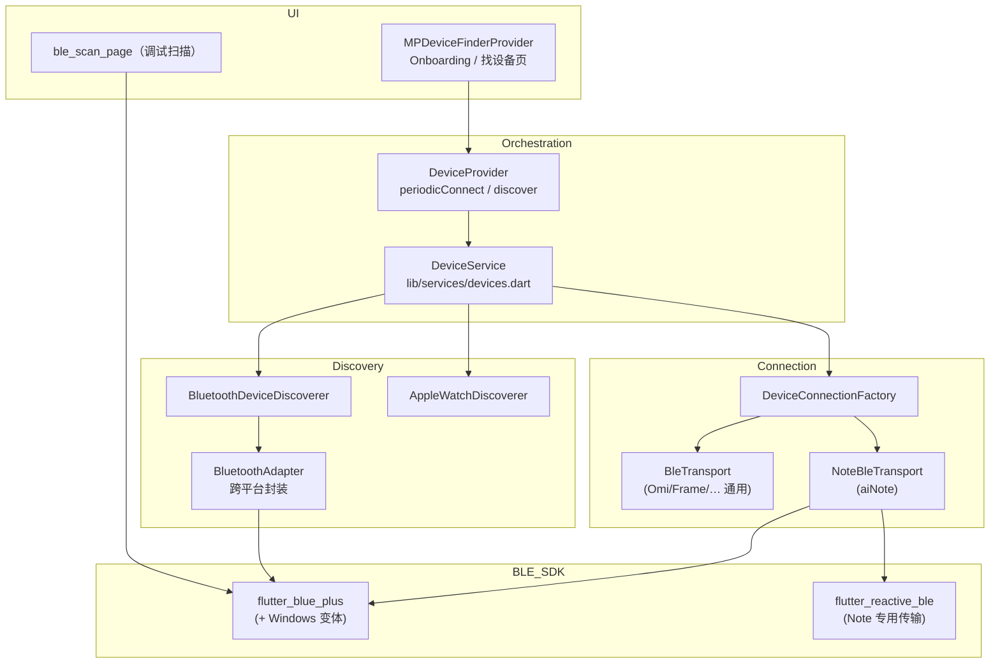

# Omi / MemoPin 应用：蓝牙扫描与连接梳理

> 基于仓库 `lib/` 代码整理，供开发与调试对照。

---

## 1. 总体架构

### 数据流摘要

- **扫描发现**：`DeviceService.discover()` 并行调用多个 `DeviceDiscoverer`，其中 BLE 路径为 `BluetoothDeviceDiscoverer` → `BluetoothAdapter.startScan()`（内部为 `flutter_blue_plus`；Windows 使用 `flutter_blue_plus_windows`）。
- **连接**：`DeviceService.ensureConnection()` → `DeviceConnectionFactory.create(BtDevice)` → 按设备类型选择传输层；多数设备使用 `BleTransport`（`BluetoothDevice.connect` + `discoverServices`）；**aiNote（MemoPin Note）** 使用 `NoteBleTransport`（`flutter_reactive_ble`，并可能配合 `flutter_blue_plus` 做部分操作）。

---

## 2. 核心代码文件（按职责）

| 职责 | 路径 |
|------|------|
| 设备服务：扫描、订阅、`ensureConnection` | `lib/services/devices.dart` |
| BLE 扫描实现（UUID 过滤 + 兜底全扫） | `lib/services/devices/discovery/bluetooth_discoverer.dart` |
| 发现抽象接口 | `lib/services/devices/discovery/device_discoverer.dart` |
| 跨平台 BLE API 封装（含 Windows） | `lib/utils/bluetooth/bluetooth_adapter.dart` |
| 连接工厂与各设备 Connection | `lib/services/devices/device_connection.dart` |
| 通用 BLE GATT 传输（连接 / MTU / 读写通知） | `lib/services/devices/transports/ble_transport.dart` |
| MemoPin Note 设备 BLE（协议栈） | `lib/services/devices/transports/note_ble_transport.dart` |
| GATT Service / Characteristic UUID 常量 | `lib/services/devices/models.dart` |
| 从扫描结果解析设备类型、是否支持 | `lib/backend/schema/bt_device/bt_device.dart` |
| 周期性扫描并重连、绑定发现逻辑 | `lib/providers/device_provider.dart`（`periodicConnect`、`discover`） |
| 找设备 / 自动连接 UI 侧 | `lib/providers/mp_device_finder_provider.dart` |
| 调试页：直接 `FlutterBluePlus.startScan` | `lib/pages/note_debug/ble_scan_page.dart` |
| 引导找设备相关页面 | `lib/pages/onboarding/find_device/`（如 `mp_page.dart`、`page.dart`、`mp_found_devices.dart`） |
| App 启动时对 BLE 日志与选项 | `lib/main.dart`（`FlutterBluePlus.setOptions` / `setLogLevel`） |

补充文档（仓库内）：

- `docs/ble-api-documentation.md`
- `docs/note-recording-api-usage.md`

---

## 3. 扫描策略要点（`BluetoothDeviceDiscoverer`）

1. 等待适配器为 **ON**，再扫描。
2. **第一轮**：`withServices` 包含三类 Service UUID（定义见 `lib/services/devices/models.dart`）：
   - `aiNoteServiceUuid`
   - `omiServiceUuid`
   - `friendPendantServiceUuid`
3. **若无结果**：第二轮 **不带 UUID 过滤**，兼容不广播 Service UUID 的设备。
4. 结果经 `BtDevice.isSupportedDevice()` 过滤，再 `BtDevice.fromScanResult()` 映射为业务模型。

---

## 4. 连接策略要点

- **`BleTransport.connect()`**：等待适配器就绪 → `connect()` → 等待 connected → Android 上 **`requestMtu(512)`** → **`discoverServices()`**。
- **`DeviceService._connectToDevice`**：若列表里找不到设备，会从 **`SharedPreferencesUtil().btDevice`** 恢复已配对设备，支持 **后台直连重连**（减少扫描）。
- **`DeviceProvider.periodicConnect`**：定时触发 **`scanAndConnectToDevice`** → 先 **`ensureConnection(pairedId)`** 直连，失败再 **`device.discover(desirableDeviceId: …)`**。

---

## 5. 依赖配置（`pubspec.yaml`）

| 依赖 | 用途 |
|------|------|
| `flutter_blue_plus` | Android / iOS / macOS 等主力 BLE |
| `flutter_blue_plus_windows` | Windows（经 `BluetoothAdapter` 分流） |
| `flutter_reactive_ble` | Note（aiNote）协议，主要在 `note_ble_transport.dart` |

---

## 6. 平台权限与特性配置

### Android — `android/app/src/main/AndroidManifest.xml`

- `android.hardware.bluetooth_le`（`required=true`）
- Android 12+：`BLUETOOTH_SCAN`（`neverForLocation`）、`BLUETOOTH_CONNECT`
- 旧版：`BLUETOOTH` / `BLUETOOTH_ADMIN`（`maxSdkVersion=30`）
- 扫描相关：`ACCESS_FINE_LOCATION`、`ACCESS_COARSE_LOCATION`
- 前台服务类型含 `connectedDevice`（与蓝牙前台使用相关）

### iOS — `ios/Runner/Info.plist`

- `NSBluetoothAlwaysUsageDescription`
- `NSBluetoothPeripheralUsageDescription`

---

## 7. 调试与扩展时建议对照

| 目标 | 优先查看 |
|------|----------|
| 扫描过滤 / 支持机型 | `bt_device.dart`（`isSupportedDevice`、`fromScanResult`）+ `bluetooth_discoverer.dart` |
| 通用连接与 GATT | `ble_transport.dart`、各 `*_connection.dart`（如 `omi_connection.dart`） |
| Note 设备协议与连接 | `note_ble_transport.dart`、`note_commands.dart`、`note_connection.dart` |
| 权限文案 | iOS `Info.plist`；Android `AndroidManifest.xml` |

---

*文档生成自项目代码梳理，若仓库变更请以源码为准。*
